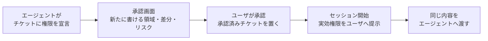
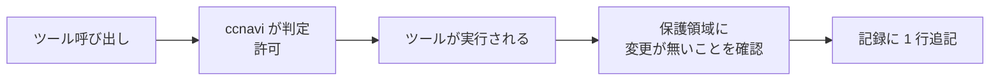
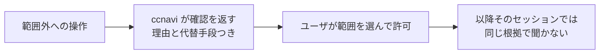
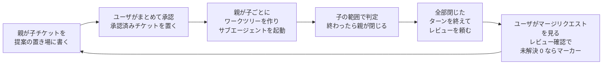

[ccnavi 要件書](../requirements.md) に戻る。

## 3. 正常な流れ

成功する筋道だけを描く。異常系は「異常時」の要求で扱う。

### 3.1 チケットの承認からセッション開始まで

```mermaid
flowchart LR
  A[エージェントが<br/>チケットに権限を宣言] --> B[承認画面<br/>新たに書ける領域・差分・リスク]
  B --> C[ユーザが承認<br/>承認済みチケットを置く]
  C --> D[セッション開始<br/>実効権限をユーザへ提示]
  D --> E[同じ内容を<br/>エージェントへ渡す]
```

### 3.2 ツール呼び出し 1 回

```mermaid
flowchart LR
  A[ツール呼び出し] --> B[ccnavi が判定<br/>許可]
  B --> C[ツールが実行される]
  C --> D[保護領域に<br/>変更が無いことを確認]
  D --> E[記録に 1 行追記]
```

### 3.3 範囲外に触れたとき

```mermaid
flowchart LR
  A[範囲外への操作] --> B[ccnavi が確認を返す<br/>理由と代替手段つき]
  B --> C[ユーザが範囲を選んで許可]
  C --> D[以降そのセッションでは<br/>同じ根拠で聞かない]
```

### 3.4 フェーズ 1 つ

```mermaid
flowchart LR
  A[親が子チケットを<br/>提案の置き場に書く] --> B[ユーザがまとめて承認<br/>承認済みチケットを置く]
  B --> C[親が子ごとに<br/>ワークツリーを作り<br/>サブエージェントを起動]
  C --> D[子の範囲で判定<br/>終わったら親が閉じる]
  D --> E[全部閉じた<br/>ターンを終えて<br/>レビューを頼む]
  E --> F[ユーザがマージリクエストを見る<br/>レビュー確認で<br/>未解決 0 ならマーカー]
  F --> A
```
