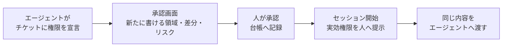
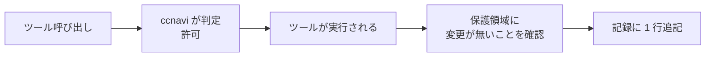
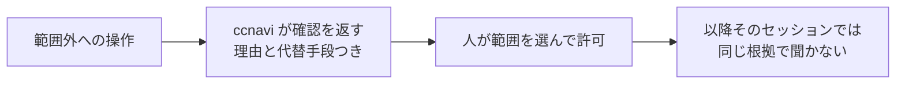

# ccnavi 要件書

## 1. 背景

Claude Code のエージェントは、作業の途中で禁止された操作をどうにか突破して
実行しようとする。悪意ではなく、作業に必要だと判断した結果として起きる。
「hook が邪魔なので外す」「deny が厳しいので緩める」も、目的を達成しようとする
素直なエージェントが普通に選ぶ手である。

既存の防ぎ方には 4 つの穴がある。

- 設定ファイルのパターン一致はコマンドの構造（連鎖・サブシェル・リダイレクト）を見ないため、複合コマンドの後段が素通りする
- プロンプトに書いた禁止は確率を下げるだけで 0 にはならない
- 権限を静的に固定すると、作業ごとに必要な範囲が違うため、広く開けるか毎回確認するかの二択になる。広く開ければ守れず、毎回確認すれば承認が形骸化する
- 拒否の根拠がすべて作業ツリーの中にあり、エージェントが書き換えられる。設定の変更は次のツール呼び出しから効く

ccnavi は「守る対象はプロジェクトが列挙し、それ以外は作業チケットに委譲する」という
分担を成立させ、委譲した先の逸脱を人間の目に触れさせることでこの二択を崩す。

失敗の向きが非対称であることを前提に置く。誤検知はエージェントが一手止まるだけで、
理由が返れば書き直せる。素通りは強制の仕組み自体を無意味にし、しかも起きたことに気づけない。
判断がつかないときは拒否側へ倒す。

ただし拒否側へ倒す原則を機械的に当てると、設定 1 つの破損が完全なロックアウトになる。
「守るために自分を止めて回復手段まで奪う」形を作らないことが、
この道具を運用に載せられるかどうかを分ける。

もう 1 つ。拒否だけを返す道具は、エージェントを止められない。
同じ問題を解いた先行実装が動機として挙げている例がそのまま当てはまる。
`git push` を禁じられたエージェントは諦めず、絶対パスで同じコマンドを打ち直す。
拒否は、目的を諦めさせるのではなく、目的を達成する別の道へ向け直さないと効かない。
だから拒否と同時に、なぜ止めたかと、代わりに何をすればよいかを名指しで返す。

---

## 2. 外部要求

ccnavi は Claude Code の hook から呼ばれる。1 回の呼び出しは、標準入力で
受け取った JSON を読み、標準出力に応答を返して終わる。実行ファイルは 1 本で、
複数のイベントに同じコマンドとして登録する。

呼び出しの間に何が動いているかは仕様側の判断であって、要求ではない。
外から縛るのは、期限までに応答が返ること、ガードが無言で消えないこと、
直した設定が次の呼び出しから効くこと、試験の判定が実運用と一致すること。
この 4 つを満たす限り、構成の取り方は問わない。

以下の面は、その呼ばれ方で分かれている。

| 面 | 呼ばれ方 |
|---|---|
| 起動と登録 (REQ-HKS) | すべてのイベントに共通 |
| 共通の動作 (REQ-CMN) | すべてのイベントに共通 |
| ルールの注入 (REQ-RUL) | すべてのイベントに共通 |
| ツール実行前の判定 (REQ-PRE) | ツール実行前のイベント |
| 返す文面 (REQ-HNT) | ツール実行前・実行後のイベント |
| ツール実行後の監視 (REQ-PST) | ツール実行後のイベント |
| セッション開始時の提示 (REQ-SES) | セッション開始のイベント |
| チケット承認ゲート (REQ-APV) | セッション開始のイベント、および人が直接起動したとき |
| 診断コマンド (REQ-DIA) | 人が直接起動したときのみ |

「呼ばれ方」の欄はイベントの役割で書いた。登録するイベントの正確な名前と
設定ファイルへの書き方は仕様側にある。イベント名が変わっても要求は生き残る。

### 2.1 起動と登録 — REQ-HKS

| ID | 型 | 要求 |
|---|---|---|
| REQ-HKS-01 | ユビキタス | ccnavi は、Claude Code の複数の hook イベントに、同一のコマンドとして登録できること |
| REQ-HKS-02 | イベント駆動 | hook から呼ばれたとき、ccnavi は、どのイベントから呼ばれたかを標準入力の内容から判別し、そのイベントに対応する判定だけを行うこと |
| REQ-HKS-03 | 望ましくない挙動 | もし対応する判定を持たないイベントから呼ばれたならば、ccnavi は、何も判定せず、ツールの実行を妨げずに終わること |
| REQ-HKS-04 | ユビキタス | ccnavi は、シェルを介さず絶対パスで直接起動でき、実行にランタイムやパッケージの追加導入を必要としない単一の実行ファイルであること |
| REQ-HKS-05 | ユビキタス | ccnavi は、起動時の作業ディレクトリがどこであっても、同じ入力に対して同じ判定を返すこと |
| REQ-HKS-06 | ユビキタス | ccnavi の判定は、同じイベントに登録された他の hook の結果に依存しないこと |
| REQ-HKS-07 | 望ましくない挙動 | もし hook の入力を与えられずに直接起動されたならば、ccnavi は、判定を行わず、hook として使う道具である旨と使い方を示して非ゼロの終了コードで終わること |

REQ-HKS-02 が入力からイベントを判別することを求めるのは、
登録側に引数でイベントを教えさせると、登録の書き間違いが
「別のイベントの判定が走る」という無言の食い違いになるため。

REQ-HKS-03 と REQ-HKS-07 は、設置を誤ったときの落ち方を分ける。
知らないイベントに登録されても作業は止めない。
入力なしに人が叩いたときは黙って 0 を返さず、使い方を出して失敗する。
何も起きずに 0 が返ると、設置を誤ったまま「動いている」と読めてしまう。

REQ-HKS-06 は、同じイベントに登録された hook が同時に走り、
どれが先に判定するかが決まらないことによる。
「先に別の hook が弾いているはず」を前提にした省略ができない。

### 2.2 共通の動作 — REQ-CMN

| ID | 型 | 要求 |
|---|---|---|
| REQ-CMN-01 | ユビキタス | ccnavi は、判定を行う間、外部プロセスを起動せず、外部ネットワークへ通信しないこと |
| REQ-CMN-02 | ユビキタス | ccnavi は、判定しない・警告・ブロックの 3 つの動作モードを持ち、モードの指定が無いときブロックで動作すること |
| REQ-CMN-03 | 状態駆動 | 警告モードである間、ccnavi は、ブロックモードと同じ判定を行い、その判定を記録と応答の両方で伝えたうえで、ツールの実行を止めないこと |
| REQ-CMN-04 | ユビキタス | ccnavi を停止させる指定は、ccnavi を起動した側の環境からのみ効き、プロジェクト内のファイルに書いても効かないこと |
| REQ-CMN-05 | 望ましくない挙動 | もしモードとして解釈できない値を与えられたならば、ccnavi は、その値を示したうえで、ブロックモードで動作すること |
| REQ-CMN-06 | ユビキタス | ccnavi は、判定した呼び出しのすべてについて、下した判定と、その判定を実際に適用したかどうかを、1 件 1 行の JSON として追記のみの記録に残すこと |
| REQ-CMN-07 | ユビキタス | ccnavi は、判定しなかった呼び出しについても、判定しなかった理由を同じ記録に残すこと |
| REQ-CMN-08 | 望ましくない挙動 | もし自身に定めた期限までに判定を終えられないならば、ccnavi は、判定を打ち切り、期限に達したことを理由として拒否側の応答を返すこと |

REQ-CMN-03 が「記録と応答の両方で伝える」と書いているのは、
警告モードの目的が観測にあるため。人が後から数える先が記録で、
エージェントがその場で読む先が応答であり、片方だけでは足りない。

REQ-CMN-05 が値を示すことを求めるのは、解釈できない設定を黙って
最も強いモードに倒すと、綴りの誤りや名前の変更が意図した選択に見えるため。
守りが強くなること自体は正しいが、そうなった理由が見えないと直せない。

REQ-CMN-06 が「適用したかどうか」を判定と分けて残すことを求めるのは、
警告モードの記録が「何を止めるはずだったか」と「何を実際に止めたか」の
両方に答える必要があるため。実際に止めた回だけを数えると、
警告モードで運用する意味がなくなる。

REQ-CMN-07 が「判定しなかった回も残す」と書いているのは、
記録の欠如を「ccnavi が働かなかった」と読めるようにするため。
止めた回だけの記録では、取りこぼしがあったかどうかを後から数えられない。

REQ-CMN-08 は、遅延が許可に化けることを防ぐ。hook は 1 回のツール呼び出しの
同期の経路にいて、期限に達すると呼び出し側に打ち切られ、応答ごと捨てられて
素通りになる。その手前で自分から拒否側に着地する。
外側で打ち切られた場合については適用範囲外の節を参照。

REQ-CMN-01 が外部プロセスの起動を禁じるのも同じ理由による。
hook はすべてのツール呼び出しで走るので、
起動のたびに別のプロセスを起こすと期限に近づく。

### 2.3 ルールの注入 — REQ-RUL

| ID | 型 | 要求 |
|---|---|---|
| REQ-RUL-01 | ユビキタス | ccnavi は、判定に使うルールを実行ファイルの外にあるファイルから読み込み、ccnavi を作り直さずにルールを追加・変更できること |
| REQ-RUL-02 | ユビキタス | ccnavi は、ルールの読み込み元を起動時の引数で指定でき、指定が無いときは既定の場所から読み込むこと |
| REQ-RUL-03 | ユビキタス | ccnavi のルール 1 件は、対象とするツール・照合する条件・一致したときに返す文面を 1 組として持つこと |
| REQ-RUL-04 | 望ましくない挙動 | もし文面を持たないルールが与えられたならば、ccnavi は、そのルールを受け付けず、どのルールが欠けているかを示すこと |
| REQ-RUL-05 | ユビキタス | ccnavi のルールは、JSON を含む機械可読な構造化テキストで表現され、書式の版番号を持つこと |
| REQ-RUL-06 | ユビキタス | ccnavi は、日常の操作を止めるルールを、正規表現を知らなくても書ける記法で受け付けること |
| REQ-RUL-07 | ユビキタス | ccnavi は、その記法で書けない条件のために正規表現も受け付け、1 件のルールがどちらで書かれているかを取り違えようのない形にすること |
| REQ-RUL-08 | 望ましくない挙動 | もし解釈できないルールがあるならば、ccnavi は、そのルールを名指しで報告し、そのルールが判定に使われていないことを示すこと |

REQ-RUL-03 と REQ-RUL-04 が「提案」を仕組みとして担保する。
代替手段を返すことを心がけとして書いても守られない。
文面をルールと同じ 1 組に入れ、欠けたルールを受け付けなければ、
ルールを 1 つ足すたびに「代わりに何をするか」を書かざるを得なくなる。

REQ-RUL-06 が要件である理由。ルールは人が書いて人がレビューする。
書き損じた正規表現は、誰の目にも留まらない穴になる。
記法が具体的にどう書けるかは仕様側にあるが、
「正規表現を書かずに日常の操作を止められる」ことは外から判定できる約束である。

REQ-RUL-07 が両者の混同を禁じるのは、同じ欄が 2 通りに読まれると、
書いた人の意図と ccnavi の解釈が黙って食い違うため。
正規表現に手を伸ばしたルールは最も注意して読むべきものなので、
それが一目で分かる形になっている必要がある。

REQ-RUL-08 が沈黙を禁じるのは、解釈できないルールを黙って飛ばすと、
防御が抜けたことに気づけないため。

### 2.4 ツール実行前の判定 — REQ-PRE

| ID | 型 | 要求 |
|---|---|---|
| REQ-PRE-01 | イベント駆動 | ツールの呼び出しが発生したとき、ccnavi は、その呼び出しを許可・確認・拒否のいずれかに判定し、Claude Code が解釈できる応答として返すこと |
| REQ-PRE-02 | ユビキタス | ccnavi は、プロジェクト設定が拒否と宣言した対象への操作を、チケット・環境変数・過去の確認の記憶のいずれによっても許可しないこと |
| REQ-PRE-03 | ユビキタス | ccnavi は、プロジェクト設定が確認と宣言した対象への操作を、人間の確認を経ずに実行させないこと |
| REQ-PRE-04 | 望ましくない挙動 | もし操作の対象を一意に確定できないならば、ccnavi は、その操作を許可としないこと |
| REQ-PRE-05 | ユビキタス | ccnavi は、自身の設定・作業中のチケットの宣言・承認の台帳を、エージェントの操作によって書き換えさせないこと |
| REQ-PRE-06 | 望ましくない挙動 | もし設定を読み取れないならば、ccnavi は、組み込みの既定で判定を続け、既定に落ちたことを示したうえで、読み取りと設定自身の修復を妨げないこと |
| REQ-PRE-07 | 状態駆動 | 利用者がある操作を確認のうえ許可して以降、ccnavi は、同一セッション内で同じ根拠による確認を繰り返さないこと。ただし設定が確認を宣言した対象を除く |
| REQ-PRE-08 | 状態駆動 | 人間に確認できないセッションである間、ccnavi は、確認が必要な操作を許可しないこと |
| REQ-PRE-09 | ユビキタス | ccnavi は、ある呼び出しへの判定を、その呼び出しの内容だけから決め、その呼び出しを引き起こしたテキストの出どころによって変えないこと |

REQ-PRE-02 と REQ-PRE-03 が信頼境界そのものである。設定は人が管理するので信頼し、
チケットはエージェントが書くので信頼しない。チケットの宣言は権限を絞ることしかできない。
REQ-PRE-05 が無いと、この境界はチケットを書き換えるだけで消える。

REQ-PRE-06 は REQ-PRE-04 の例外にあたる。「設定が読めない」は
「判断できない」ではなく「設定が壊れている」であり、拒否側へ倒すと
壊れた設定を直す操作まで止まって回復できなくなる。

REQ-PRE-09 が出どころを禁じるのは、「利用者が頼んだ操作だから通す」を実装する材料が
hook の入力に無いため。入力にあるのは呼び出されるツールと引数だけで、それが利用者の文から
来たのか、取り込んだページ・依存パッケージの README・issue の本文に混ざっていた指示から
来たのかは書かれていない。エージェントのコンテキストでも両者は同じ形の文字列として並ぶ。
出どころを理由にした例外を作れば、その例外は注入された文からも同じように名乗れる。
REQ-PRE-07 の確認の記憶はこれに反しない。あれは人が明示的に許可した事実を根拠にしており、
呼び出しの出どころを根拠にしていない。

### 2.5 返す文面 — REQ-HNT

| ID | 型 | 要求 |
|---|---|---|
| REQ-HNT-01 | イベント駆動 | 1 回の呼び出しを判定したとき、ccnavi は、該当したすべての拒否と確認の理由を 1 回の応答にまとめて返すこと |
| REQ-HNT-02 | ユビキタス | ccnavi が返す理由は、対象・理由コード・根拠となった設定の出所を含み、他の判定の結果に言及せずそれだけで読んで成立すること |
| REQ-HNT-03 | ユビキタス | ccnavi は、拒否した操作に代替手段があるときその手段を名指しで示し、代替が無いときは無いことを示すこと |
| REQ-HNT-04 | ユビキタス | ccnavi は、判定の材料が揃わずに拒否側へ倒したとき、宣言された禁止に当たった場合とは異なる文面で、判定を妨げた箇所を示すこと |

REQ-HNT-04 が要件である理由。文書に禁止語を書いただけで止まった読み手に
「禁止された操作を行った」と伝えると、していないことを直せと言うことになり、
次の一手が 1 つも得られない。何が判定を妨げたかを書けば、
別の道具に切り替える・本文をファイルへ逃がす、という一手に辿り着ける。

REQ-HNT-02 が他の判定に言及しないことを求めるのは、
同じ出来事に対して複数の判定が同時に走り、どれが利用者に見えるかが決まらないため。

### 2.6 ツール実行後の監視 — REQ-PST

| ID | 型 | 要求 |
|---|---|---|
| REQ-PST-01 | イベント駆動 | ツールの実行が完了したとき、ccnavi は、プロジェクト設定が書き込み拒否と宣言した領域のファイルが変更されていないかを検証すること |
| REQ-PST-02 | イベント駆動 | 保護領域の変更を検知したとき、ccnavi は、変更されたファイル・該当する設定・原因となった直前の実行を、エージェントに届く差し戻しの文として返すこと |
| REQ-PST-03 | イベント駆動 | 保護領域の変更を検知したとき、ccnavi は、その変更を元に戻す手順を対象ごとに示すこと |
| REQ-PST-04 | イベント駆動 | 保護領域の変更を検知したとき、ccnavi は、その実行を許可した確認の記憶を無効にし、以降の同じ操作で再び確認が発生すること |
| REQ-PST-05 | オプション | 自動復元が有効である場合、ccnavi は、検知した変更を元に戻し、戻した対象を示すこと |

この面は実行後に走るので、操作そのものを取り消せない。REQ-PST-02 が
「止める」ではなく「差し戻しの文として返す」と書いているのはそのため。

### 2.7 セッション開始時の提示 — REQ-SES

| ID | 型 | 要求 |
|---|---|---|
| REQ-SES-01 | イベント駆動 | セッションが開始されたとき、ccnavi は、無確認で書き込める領域・確認付きで書き込める領域・使えないツールを利用者に示すこと |
| REQ-SES-02 | イベント駆動 | チケットの要求が上位の設定によって却下されたとき、ccnavi は、却下された要求・理由・却下した設定の出所を利用者に示すこと |
| REQ-SES-03 | イベント駆動 | チケットが想定作業範囲の外へ許可を与えたとき、ccnavi は、それを却下された要求と区別し、先に読む位置へ置いて示すこと |
| REQ-SES-04 | イベント駆動 | セッションが開始されたとき、ccnavi は、同じ内容をエージェント側にも渡し、使えない権限とその代替手段を伝えること |
| REQ-SES-05 | 状態駆動 | ccnavi 自身または設定が承認された内容と異なる間、ccnavi は、その差分を示し、承認されるまで許可を与えないこと |

REQ-SES-03 の区別が要件である理由。却下された要求は実害が出ないが、
想定外なのに許可された権限は実際に使われる。同じ一覧に混ぜると後者が読み飛ばされる。

### 2.8 チケット承認ゲート — REQ-APV

| ID | 型 | 要求 |
|---|---|---|
| REQ-APV-01 | イベント駆動 | チケットの承認を求められたとき、ccnavi は、そのチケットによって新たに無確認で書き込めるようになる領域を、提示の最初に置くこと |
| REQ-APV-02 | イベント駆動 | チケットの承認を求められたとき、ccnavi は、前回承認されたチケットからの権限の差分と、段階の付いたリスクの数値を示すこと |
| REQ-APV-03 | 状態駆動 | リスクが高いと判定されたチケットである間、ccnavi は、単一キーによる承認を受け付けず、チケット識別子の入力を要求すること |
| REQ-APV-04 | 状態駆動 | 現在のチケットの内容が承認された内容と一致しない間、ccnavi は、そのチケットが与える許可をすべて確認以上の厳しさに落とすこと |
| REQ-APV-05 | イベント駆動 | チケットが承認されたとき、ccnavi は、承認された内容・時刻・対応する設定の版を、追記のみの台帳に残すこと |

### 2.9 診断コマンド — REQ-DIA

| ID | 型 | 要求 |
|---|---|---|
| REQ-DIA-01 | イベント駆動 | 実効権限の表示を求められたとき、ccnavi は、現在の設定・チケット・環境変数から決まる読み・書き・実行それぞれの許可を、判定を行わずに一覧すること |
| REQ-DIA-02 | イベント駆動 | ツールと対象を与えて試験を求められたとき、ccnavi は、操作を実行せずに判定結果とすべての理由を返すこと |
| REQ-DIA-03 | ユビキタス | ccnavi が試験で返す判定は、同じ入力に対して実運用で返す判定と一致すること |
| REQ-DIA-04 | イベント駆動 | 設定の検証を求められたとき、ccnavi は、防御を無効化しうる記述を error と warn に分けて報告し、error があれば非ゼロの終了コードで終わること |
| REQ-DIA-05 | イベント駆動 | 確認の記憶の表示または消去を求められたとき、ccnavi は、保持している対象を一覧し、消去後は同じ操作で再び確認が発生すること |

この面だけは hook から呼ばれない。人が端末から叩く。

REQ-DIA-03 が無いと、警告モードや試験で得た結果が、ブロックモードの保証にならない。
hook 経由の判定と端末からの試験が別の道を通ると、試験は当てにならなくなる。

---

## 3. ハッピーパス

成功する筋道だけを描く。異常系は「望ましくない挙動」の要求が持つ。

### 3.1 チケットの承認からセッション開始まで

### 3.2 ツール呼び出し 1 回

### 3.3 範囲外に触れたとき

---

## 4. 適用範囲外

この節は受入テストから復元できない。要求を削るときもここは削らない。

- **敵対的な回避への防御**。意図的な文字列の分割、変数展開、alias 経由の実行は対象にしない。完全なシェルパーサを書いても守れる範囲は広がらない。破られてはいけない線は OS の権限分離と sandbox が引く
- **ccnavi の外側で打ち切られた場合**。プロセスごと終了させられると応答が捨てられ、ツール呼び出しはそのまま通る。ccnavi は自分の期限で先回りするが、外側の打ち切りには手が出ない
- **Git の管理下にないファイルへの事後検知**。追跡されていない変更・リポジトリ外への出力は検知しない
- **情報流出を防ぎ切ること**。外へ送れる形のコマンドは、他のコマンドと同じくルールで拒否と誘導の対象にできる。範囲外なのは防ぐことではなく、防ぎ切ると約束することである。ccnavi はネットワークを遮断しないので、判定は送信の形の一覧に頼り、その一覧は網羅ではない。スクリプトの中で送る形（`node send.js`）はコマンド名しか見ないので届かず、Bash 以外の送信経路（取得したページ本文を載せる URL、外へ投げる MCP サーバ）も対象の抽出に入らない。egress を閉じられる sandbox やネットワークポリシーがあるならそちらが上位で、ccnavi はその補助にしかならない
- **同一ユーザー権限で任意のシェルを実行できる主体への防御**。同じ権限で動く以上、ccnavi は境界にならない。被害の上限を決めるのは OS・DB・実行環境の権限分離である
- **プロジェクト設定が列挙していない領域の保護の保証**。未宣言の領域はチケットへ委譲する設計であり、列挙漏れは防げない。逸脱の可視化は是正のための仕組みであって保証ではない
- **チケットそのものの生成**。チケットはエージェントが書き、人間が承認する。ccnavi は生成せず、検証と提示だけを行う
- **設定変更の適用そのものを止めること**。ccnavi はツール呼び出しの時点で止める。動作中のセッションへの設定反映を止める層は Claude Code 固有であり、他のエージェント CLI には対応する仕組みが無い
- **Claude Code 以外のエージェントや IDE への対応**。ツール名と入出力の書式が異なるため、対応するにはその読み替えの層が要る。本書では扱わない
- **秘密情報の保管・暗号化・受け渡し**

---

## 5. 受け入れ条件

要求の数はテストの本数を決めない。本数を決めるのは、別の入力を用意しないと引けない
条件の数である。以下の 7 本で全要求を引き、各行はコマンド 1 つで回って
終了コードで合否が付く。

| # | 通し確認 | 入力に仕込むもの | 引く要求 |
|---|---|---|---|
| 1 | 標準の作業 1 セッション分を通す | 範囲内外・境界値（記号を含むパス、シンボリックリンク、新規作成パス、変数展開を含むコマンド、連鎖コマンド、本文に禁止語を含むヒアドキュメント、外へデータを出せる形のコマンド）を 1 つのリポジトリに仕込み、同じ呼び出しを transcript の内容だけ変えて 2 度通す | REQ-HKS-01, REQ-HKS-04〜06, REQ-CMN-01, REQ-CMN-06, REQ-CMN-07, REQ-PRE-01〜04, REQ-PRE-07, REQ-PRE-09, REQ-HNT-01〜04, REQ-SES-01, REQ-SES-04, REQ-DIA-01〜03 |
| 2 | チケットが権限を広げようとする入力を通す | 上位設定より緩い要求、想定範囲外への許可、チケット自身と設定の書き換え | REQ-PRE-02, REQ-PRE-03, REQ-PRE-05, REQ-SES-02, REQ-SES-03, REQ-APV-01〜03, REQ-APV-05 |
| 3 | 実行が保護領域にファイルを生成する入力を通す | ビルドが保護領域へ出力する構成、自動復元の有効と無効 | REQ-PST-01〜05, REQ-PRE-07 の失効 |
| 4 | 縮退させた状態で通す | 設定の破損、承認内容との不一致、人間に確認できない環境、判定が期限に達する入力、hook の入力を与えない直接起動、対応する判定を持たないイベントからの呼び出し | REQ-HKS-03, REQ-HKS-07, REQ-CMN-08, REQ-PRE-06, REQ-PRE-08, REQ-APV-04, REQ-SES-05, REQ-DIA-04 |
| 5 | 3 つの動作モードで同じ入力を通す | 3 モードそれぞれ、モードとして解釈できない値、および停止をプロジェクト内のファイルから指定した入力 | REQ-CMN-02〜05, REQ-DIA-05 |
| 6 | ルールを差し替えて同じ入力を通す | 既定の場所と引数で指定した場所、やさしい記法と正規表現の両方、文面を欠いたルール、両方を書いたルール、解釈できないルール、版番号の異なる書式 | REQ-RUL-01〜08 |
| 7 | 同じ実行ファイルを各イベントから呼ぶ | 実行前・実行後・セッション開始の各イベントの入力を、同じコマンドに順に与える | REQ-HKS-01, REQ-HKS-02, REQ-PRE-01, REQ-PST-01, REQ-SES-01 |

判定はすべて ccnavi の外側から行う。標準入力に hook の入力を与え、
標準出力の応答・標準エラーの提示・記録の行・終了コード・
ファイルシステムの実態だけを見る。内部の関数は呼ばない。

上限を約束している要求（REQ-PRE-02, REQ-PRE-03, REQ-PRE-04, REQ-APV-04）は、
「どう設定しても破れない」ことが主張なので、設定・チケット・環境変数・
確認の記憶の組み合わせを変えた入力に対して、すべて同じ結果になることを確認する。

REQ-PRE-09 も同じ形で確認する。ツール名と引数を固定したまま transcript の内容だけを
変えた入力を与え、判定が変わらないことを見る。出どころを読み取れる材料は入力の中では
transcript しかないので、そこを動かして結果が動かないことが、出どころを見ていない証拠になる。

REQ-PRE-06 と REQ-CMN-04 には**負のコントロール**を置く。
「拒否されない」だけの確認は、対象の抽出そのものが壊れていても通ってしまう。
設定が壊れている間に設定自身の修復が通ること、
プロジェクト内のファイルに停止を書いても止まらないこと、の 2 つを別の行として確認する。

---

## 付録. 本書に書かなかった文

要件から外した理由の置き場。決定ログの種にあたる。

### A. 観測フィルタで落ちた文（仕様へ移した）

利用者が中身を知らなくても真偽を判定できない文。すべて [ccnavi.md](ccnavi.md) にある。

| 仕様へ移した内容 | 移した理由 |
|---|---|
| 設定を 4 レイヤに分ける構成と合成規則 | 実効権限が外から見えれば、内部が何層かは判定に不要 |
| 最も厳しい値を選ぶ合成関数、設定のハッシュ算出 | 上限を約束する要求が結果を外から縛っている |
| シェルのトークン分解、コメント除去、クォート保全、サブシェル再帰、コマンド位置の走査 | 解析手法を変えても要求は生き残る。「対象を確定できないなら許可しない」が結果を縛る |
| ヒアドキュメントの本文を実行位置として数えないこと | 同上。外から見えるのは「文書に禁止語を書いても止まらない」という結果だけ |
| リダイレクト・ヒアドキュメント・tee を一律拒否する判断 | 「対象を確定できない操作は許可しない」の実装上の帰結 |
| DB 破壊操作を 2 段階で共起検知する方式 | 同上。順序を入れ替えても回避されないことは通し確認 1 で引く |
| 確認の記憶のキー設計・正規化・失効条件・内容ハッシュ | 「同じ根拠で繰り返し聞かない」「保護領域を汚した記憶は無効になる」が外から縛っている |
| リスクスコアの配点表と閾値 | 「段階の付いた数値が出ること」までを要求とする。配点は運用で動く |
| 理由コードの一覧 | 「理由コードを含むこと」までを要求とする |
| 実行後の監視に git の差分照会を使うこと | 結果を要求が縛る。追跡外のファイルを見ない限界は適用範囲外へ残した |
| 登録する hook イベントの正確な名前、設定ファイルへの書き方、絶対パスでの登録、Windows での起動経路 | 「複数のイベントに同じコマンドとして登録できる」「入力からイベントを判別する」「作業ディレクトリに依らず同じ判定を返す」が外から縛っている。イベント名が変わっても要求は生き残る |
| 期限の具体値、外部プロセスを起こさない実装の詳細 | 「期限に達したら拒否側へ着地する」「判定中に外部プロセスを起こさない」は素通りの原因に直結するので要求に残し、秒数と実装は仕様へ |
| ルールファイルの具体的な書式（キー名、既定の置き場）と、やさしい記法の記号と変換規則 | 「外部から注入できる」「1 件が対象・条件・文面を持つ」「正規表現を知らなくても書ける」までを要求とする。記号が何文字あるかを変えても要求は生き残る |
| モードと記録先を環境変数で渡すこと、その変数名 | 「3 つのモードを持つ」「停止は起動側の環境からのみ効く」「1 件 1 行で記録する」が結果を外から縛っている |

### B. 必要性フィルタで落ちた文（どこにも書かない）

消しても誰も困らない文。

- 「ccnavi は Go で実装する」— 利用者から見た性質は単一実行ファイルと外部プロセス非起動に出ており、言語名は判定に使えない
- 「判定は高速であること」— 数値のない性能要求は真偽を判定できない。素通りに直結する期限だけを要求として残した
- 「設定はわかりやすい形式であること」— 判定できない
- 「エージェントに親切なメッセージを返すこと」— 返す文面の 4 要求が具体化しているため重複
- 「段階的に導入できること」— 導入手順であって成果物の性質ではない。3 つの動作モードが外から見える形で同じ目的を果たす
- 「hook の登録を設定ファイルに書くこと」— 利用者の設置作業であって、ccnavi が満たす性質ではない

### C. 検討して採らなかった点

同じ問題を「拒否と誘導」で解いた実装を参照した。採った点は本文に入っている。
拒否の文面が代替手段を名指しすること、その文面をルールと同じ 1 組に置くこと、
ルールを外部ファイルから注入すること、hook の入力なしに直接起動されたら
非ゼロで終わること、判定を標準入出力だけで外から確認できること。
採らなかったのは次の 3 点。3 つ目は先行実装とは関係なく、本書を書く途中で出た案。

| 採らなかった点 | 理由 |
|---|---|
| 最初に一致したルールで打ち切って返す | ccnavi は複数種類の検査を持つので、1 つ返すとエージェントが 1 つずつ直して再試行し、往復が増える。該当したすべての理由を 1 回で返す側を採った |
| 複数のエージェント CLI に対応し、ツール名を中立な語彙へ読み替える | 対象を Claude Code に絞った。ただしこれは要件から落としただけで、対応が要るときに足す層が読み替えであることは分かっている |
| セッション開始時に常駐させ、以降の呼び出しをそこへ取り次ぐ | `command` 型の hook である限り呼び出しごとのプロセス起動は消えず、常駐はその上に通信を 1 往復足すだけになる。起動を実際に省けるのは通信型の hook にしたときで、それは判定を待ちの相手に預けることになり、相手が固まればガードが無言で消える。加えて、古い設定のまま判定し続ける経路と、寿命の管理が新たに要る。得られるのは設定の読み込みと正規表現のコンパイルの節約だけで、避けられないプロセス起動の前では小さい。速さが問題になったときは、まず測り、次に正規化済みのルールをファイルへ落として設定が変わるまで使い回す。常駐はその後 |
