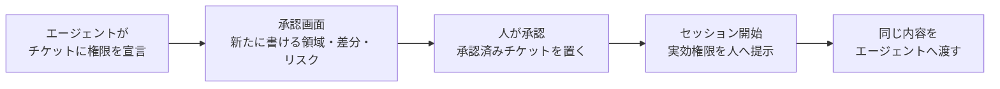
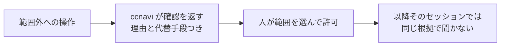
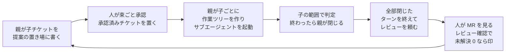

# ccnavi 要件書

## 1. 背景

Claude Code のエージェントは、作業の途中で禁止された操作をどうにか突破して
実行しようとする。悪意ではなく、作業に必要だと判断した結果として起きる。
「hook が邪魔なので外す」「deny が厳しいので緩める」も、目的を達成しようとする
素直なエージェントが普通に選ぶ手である。

既存の防ぎ方には 4 つの穴がある。

- 設定ファイルのパターン一致はコマンドの構造（連鎖・サブシェル・リダイレクト）を見ないため、複合コマンドの後段が素通りする
- プロンプトに書いた禁止は確率を下げるだけで 0 にはならない
- 権限を静的に固定すると、作業ごとに必要な範囲が違うため、広く開けるか毎回確認するかの二択になる。広く開ければ守れず、毎回確認すれば承認が形骸化する
- 拒否の根拠がすべて作業ツリーの中にあり、エージェントが書き換えられる。設定の変更は次のツール呼び出しから効く

ccnavi は「守る対象はプロジェクトが列挙し、それ以外は作業チケットに委譲する」という
分担を成立させ、委譲した先の逸脱を人間の目に触れさせることでこの二択を崩す。

失敗の向きが非対称であることを前提に置く。誤検知はエージェントが一手止まるだけで、
理由が返れば書き直せる。素通りは強制の仕組み自体を無意味にし、しかも起きたことに気づけない。
判断がつかないときは拒否側へ倒す。

ただし拒否側へ倒す原則を機械的に当てると、設定 1 つの破損が完全な締め出しになる。
「守るために自分を止めて回復手段まで奪う」形を作らないことが、
この道具を運用に載せられるかどうかを分ける。

もう 1 つ。拒否だけを返す道具は、エージェントを止められない。
同じ問題を解いた先行実装が動機として挙げている例がそのまま当てはまる。
`git push` を禁じられたエージェントは諦めず、絶対パスで同じコマンドを打ち直す。
拒否は、目的を諦めさせるのではなく、目的を達成する別の道へ向け直さないと効かない。
だから拒否と同時に、なぜ止めたかと、代わりに何をすればよいかを名指しで返す。

---

## 2. 外部要求

ccnavi は Claude Code の hook から呼ばれる。1 回の呼び出しは、標準入力で
受け取った JSON を読み、標準出力に応答を返して終わる。実行ファイルは 1 本で、
複数のイベントに同じコマンドとして登録する。

呼び出しの間に何が動いているかは仕様側の判断であって、要求ではない。
外から縛るのは、期限までに応答が返ること、ガードが無言で消えないこと、
直した設定が次の呼び出しから効くこと、試験の判定が実運用と一致すること。
この 4 つを満たす限り、構成の取り方は問わない。

要求の「型」は、その要求がいつ効くかを表す。常時（いつでも成り立つ）、事象（あることが起きたとき）、
状態（ある状態である間）、異常時（望ましくないことが起きたなら）、任意（その機能を使う場合）の 5 つ。

以下の面は、その呼ばれ方で分かれている。

| 面 | 呼ばれ方 |
|---|---|
| 起動と登録 (REQ-HKS) | すべてのイベントに共通 |
| 共通の動作 (REQ-CMN) | すべてのイベントに共通 |
| ルールの注入 (REQ-RUL) | すべてのイベントに共通 |
| ツール実行前の判定 (REQ-PRE) | ツール実行前のイベント |
| 返す文面 (REQ-HNT) | ツール実行前・実行後のイベント |
| ツール実行後の監視 (REQ-PST) | ツール実行後、およびターンの始まりと終わりのイベント |
| 設定ファイルの自己防衛 (REQ-SLF) | ツール実行前・実行後、およびセッション開始のイベント |
| セッション開始時の提示 (REQ-SES) | セッション開始のイベント |
| チケット承認ゲート (REQ-APV) | セッション開始のイベント、および人が直接起動したとき |
| 実績で測るリスク (REQ-RSK) | 人が直接起動したとき（子を閉じるとき）、およびツール実行後のイベント |
| 診断コマンド (REQ-DIA) | 人が直接起動したときのみ |
| 並行するチケット (REQ-TKT) | ツール実行前・実行後、サブエージェントの開始と終了のイベント、および人が直接起動したとき |
| 複数のリポジトリ (REQ-MLT) | すべてのイベント、および人が直接起動したとき |

「呼ばれ方」の欄はイベントの役割で書いた。登録するイベントの正確な名前と
設定ファイルへの書き方は仕様側にある。イベント名が変わっても要求は生き残る。

### 2.1 起動と登録 — REQ-HKS

| ID | 型 | 要求 |
|---|---|---|
| REQ-HKS-01 | 常時 | ccnavi は、Claude Code の複数の hook イベントに、同一のコマンドとして登録できること |
| REQ-HKS-02 | 事象 | hook から呼ばれたとき、ccnavi は、どのイベントから呼ばれたかを標準入力の内容から判別し、そのイベントに対応する判定だけを行うこと |
| REQ-HKS-03 | 異常時 | もし対応する判定を持たないイベントから呼ばれたならば、ccnavi は、何も判定せず、ツールの実行を妨げずに終わること |
| REQ-HKS-04 | 常時 | ccnavi は、シェルを介さず絶対パスで直接起動でき、利用する側にランタイムやパッケージの追加導入を求めない実行ファイルとして配布できること |
| REQ-HKS-05 | 常時 | ccnavi は、起動時の作業ディレクトリがどこであっても、同じ入力に対して同じ判定を返すこと |
| REQ-HKS-06 | 常時 | ccnavi の判定は、同じイベントに登録された他の hook の結果に依存しないこと |
| REQ-HKS-07 | 異常時 | もし hook の入力を与えられずに直接起動されたならば、ccnavi は、判定を行わず、hook として使う道具である旨と使い方を示して非ゼロの終了コードで終わること |

REQ-HKS-02 が入力からイベントを判別することを求めるのは、
登録側に引数でイベントを教えさせると、登録の書き間違いが
「別のイベントの判定が走る」という無言の食い違いになるため。

REQ-HKS-03 と REQ-HKS-07 は、設置を誤ったときの落ち方を分ける。
知らないイベントに登録されても作業は止めない。
入力なしに人が叩いたときは黙って 0 を返さず、使い方を出して失敗する。
何も起きずに 0 が返ると、設置を誤ったまま「動いている」と読めてしまう。

REQ-HKS-06 は、同じイベントに登録された hook が同時に走り、
どれが先に判定するかが決まらないことによる。
「先に別の hook が弾いているはず」を前提にした省略ができない。

### 2.2 共通の動作 — REQ-CMN

| ID | 型 | 要求 |
|---|---|---|
| REQ-CMN-01 | 常時 | ccnavi は、ツールの実行前の判定を行う間、外部プロセスを起動せず、外部ネットワークへ通信しないこと |
| REQ-CMN-02 | 常時 | ccnavi は、判定しない・判定して報告するだけ・判定を適用するの 3 つの動作モードを持ち、モードの指定が無いときブロックで動作すること |
| REQ-CMN-03 | 状態 | 報告するだけのモードである間、ccnavi は、適用するモードと同じ判定を行い、その判定を記録と応答の両方で伝えたうえで、ツールの実行を止めないこと |
| REQ-CMN-04 | 常時 | ccnavi を停止させる指定は、ccnavi を起動した側の環境からのみ効き、プロジェクト内のファイルに書いても効かないこと |
| REQ-CMN-05 | 異常時 | もしモードとして解釈できない値を与えられたならば、ccnavi は、その値を示したうえで、判定を適用するモードで動作すること |
| REQ-CMN-06 | 常時 | ccnavi は、判定した呼び出しのすべてについて、下した判定と、その判定を実際に適用したかどうかを、1 件 1 行の JSON として追記のみの記録に残すこと |
| REQ-CMN-07 | 常時 | ccnavi は、判定しなかった呼び出しについても、判定しなかった理由を同じ記録に残すこと |
| REQ-CMN-08 | 異常時 | もし自身に定めた期限までに判定を終えられないならば、ccnavi は、判定を打ち切り、期限に達したことを理由として拒否側の応答を返すこと |
| REQ-CMN-09 | 状態 | 戻す働きが予行と設定されている間、または報告するだけのモードである間、ccnavi は、作業ツリーのファイルを戻さず、戻していたはずの対象を示すこと |

REQ-CMN-03 が「記録と応答の両方で伝える」と書いているのは、
報告するだけのモードの目的が観測にあるため。人が後から数える先が記録で、
エージェントがその場で読む先が応答であり、片方だけでは足りない。

REQ-CMN-05 が値を示すことを求めるのは、解釈できない設定を黙って
最も強いモードに倒すと、綴りの誤りや名前の変更が意図した選択に見えるため。
守りが強くなること自体は正しいが、そうなった理由が見えないと直せない。

REQ-CMN-06 が「適用したかどうか」を判定と分けて残すことを求めるのは、
報告するだけのモードの記録が「何を止めるはずだったか」と「何を実際に止めたか」の
両方に答える必要があるため。実際に止めた回だけを数えると、
報告するだけのモードで運用する意味がなくなる。

REQ-CMN-07 が「判定しなかった回も残す」と書いているのは、
記録の欠如を「ccnavi が働かなかった」と読めるようにするため。
止めた回だけの記録では、取りこぼしがあったかどうかを後から数えられない。

REQ-CMN-08 は、遅延が許可に化けることを防ぐ。hook は 1 回のツール呼び出しの
同期の経路にいて、期限に達すると呼び出し側に打ち切られ、応答ごと捨てられて
素通りになる。その手前で自分から拒否側に着地する。
外側で打ち切られた場合については適用範囲外の節を参照。

REQ-CMN-01 が外部プロセスの起動を禁じるのも同じ理由による。
hook はすべてのツール呼び出しで走るので、
起動のたびに別のプロセスを起こすと期限に近づく。

REQ-CMN-09 が 2 つの条件を 1 行にまとめているのは、戻す働きが 2 つ（REQ-PST-05 の
ルール由来の保護と、REQ-SLF-02 のコアファイルの保護）あり、どちらも同じ形で
モードの下に置かれるため。掛ける場所を分けると、2 つの設定が別々にモードを
解釈して食い違う。組み合わせは次の表になる。

| 動作モード | 戻す働きの設定 | 起きること |
|---|---|---|
| 適用する | 有効 | 戻す。戻した対象を示す |
| 適用する | 予行 | 戻さない。戻していたはずの対象を示す |
| 適用する | 無効 | 戻さない。予行の文も出さない |
| 報告するだけ | 有効 | 戻さない。戻していたはずの対象を示す |
| 報告するだけ | 予行 | 同上 |
| 報告するだけ | 無効 | 戻さない。予行の文も出さない |
| 判定しない | いずれでも | この面自体が動かない |

戻す働きが 2 値ではなく 3 値である理由は、表の 2 行目にある。判定は本番のまま
戻しだけを予行にする状態が要る。ルール由来の保護は対象がプロジェクトの宣言次第で
動くので、宣言の書き損じがそのまま「頼んでいないファイル操作」になる。何が戻るのかを
戻される前に見せる段が無いと、それを確かめるには判定ごと報告するだけのモードに落とすしかない。
2 値にすると、この行が 3 行目（無効）と同じ見た目になり、予行として置いた設定が
「戻しは要らない」という結論に読み替えられる。

無効と予行を見分けられることも同じ理由で要る。何も出さない側と「戻すはずだった」と
言う側が同じ文面になるなら、3 値は 2 値でしかない。

REQ-CMN-01 が実行前に限られるのは、この理屈が掛かるのが呼び出しを止めている間だけだから。
実行前の判定は同期の経路にいて、遅れがそのまま素通りに化ける。実行後の検証は
呼び出しを止めていないので、遅れても取りこぼしになるだけで、許可には化けない。
実行後に何を使ってよいかは仕様側が決める。

### 2.3 ルールの注入 — REQ-RUL

| ID | 型 | 要求 |
|---|---|---|
| REQ-RUL-01 | 常時 | ccnavi は、判定に使うルールを実行ファイルの外にあるファイルから読み込み、ccnavi を作り直さずにルールを追加・変更できること |
| REQ-RUL-02 | 常時 | ccnavi は、ルールの読み込み元を起動時の引数で指定でき、指定が無いときは既定の場所から読み込むこと |
| REQ-RUL-03 | 常時 | ccnavi のルール 1 件は、対象とするツール・照合する条件・一致したときに返す文面を 1 組として持つこと |
| REQ-RUL-04 | 異常時 | もし文面を持たないルールが与えられたならば、ccnavi は、そのルールを受け付けず、どのルールが欠けているかを示すこと |
| REQ-RUL-05 | 常時 | ccnavi のルールは、JSON を含む機械可読な構造化テキストで表現され、書式の版番号を持つこと |
| REQ-RUL-06 | 常時 | ccnavi は、日常の操作を止めるルールを、正規表現を知らなくても書ける記法で受け付けること |
| REQ-RUL-07 | 常時 | ccnavi は、その記法で書けない条件のために正規表現も受け付け、1 件のルールがどちらで書かれているかを取り違えようのない形にすること |
| REQ-RUL-08 | 異常時 | もし解釈できないルールがあるならば、ccnavi は、そのルールを名指しで報告し、そのルールが判定に使われていないことを示すこと |

REQ-RUL-03 と REQ-RUL-04 が「提案」を仕組みとして担保する。
代替手段を返すことを心がけとして書いても守られない。
文面をルールと同じ 1 組に入れ、欠けたルールを受け付けなければ、
ルールを 1 つ足すたびに「代わりに何をするか」を書かざるを得なくなる。

REQ-RUL-06 が要件である理由。ルールは人が書いて人がレビューする。
書き損じた正規表現は、誰の目にも留まらない穴になる。
記法が具体的にどう書けるかは仕様側にあるが、
「正規表現を書かずに日常の操作を止められる」ことは外から判定できる約束である。

REQ-RUL-07 が両者の混同を禁じるのは、同じ欄が 2 通りに読まれると、
書いた人の意図と ccnavi の解釈が黙って食い違うため。
正規表現に手を伸ばしたルールは最も注意して読むべきものなので、
それが一目で分かる形になっている必要がある。

REQ-RUL-08 が沈黙を禁じるのは、解釈できないルールを黙って飛ばすと、
防御が抜けたことに気づけないため。

### 2.4 ツール実行前の判定 — REQ-PRE

| ID | 型 | 要求 |
|---|---|---|
| REQ-PRE-01 | 事象 | ツールの呼び出しが発生したとき、ccnavi は、その呼び出しを許可・確認・拒否のいずれかに判定し、Claude Code が解釈できる応答として返すこと。ただし設定がその対象に言及していない呼び出しについては、REQ-PRE-10 に従う |
| REQ-PRE-02 | 常時 | ccnavi は、プロジェクト設定が拒否と宣言した対象への操作を、チケット・環境変数・過去の確認の記憶のいずれによっても許可しないこと |
| REQ-PRE-03 | 常時 | ccnavi は、プロジェクト設定が確認と宣言した対象への操作を、人間の確認を経ずに実行させないこと |
| REQ-PRE-04 | 異常時 | もし操作の対象を一意に確定できないならば、ccnavi は、その操作を許可としないこと |
| REQ-PRE-05 | 常時 | ccnavi は、自身の設定・承認済みチケット・レビュー済みの印を、エージェントの操作によって書き換えさせないこと |
| REQ-PRE-06 | 異常時 | もし設定を読み取れないならば、ccnavi は、組み込みの既定で判定を続け、既定に落ちたことを示したうえで、読み取りと設定自身の修復を妨げないこと |
| REQ-PRE-07 | 状態 | 利用者がある操作を確認のうえ許可して以降、ccnavi は、同一セッション内で同じ根拠による確認を繰り返さないこと。ただし設定が確認を宣言した対象を除く |
| REQ-PRE-08 | 状態 | 人間に確認できないセッションである間、ccnavi は、確認が必要な操作を許可しないこと |
| REQ-PRE-09 | 常時 | ccnavi は、ある呼び出しへの判定を、その呼び出しの内容だけから決め、その呼び出しを引き起こしたテキストの出どころによって変えないこと |
| REQ-PRE-10 | 状態 | 設定がその対象に言及していない間、ccnavi は、その呼び出しについて自身の判定を返さず、扱いを Claude Code の権限モードに委ね、委ねたことを記録に残すこと。ただし REQ-PRE-04 と REQ-PRE-08 に該当する呼び出しを除く |
| REQ-PRE-11 | 事象 | 当たったルールがモデルへ渡す文（`additionalContext`）を持つとき、ccnavi は、判定が許可・確認・拒否のいずれであっても、またモードが判定に手を出さないものであっても、その文を判定とは別の経路でモデルに届けること。文を持たないルールでは何も足さないこと。ルールが「1 度だけ渡す文」（`additionalContextOnce`）を持つなら、その文は同じ文脈（セッション、サブエージェントはその起動ごと）では最初に当たったときだけ届け、セッションの開始のたびに改めて届けること。両方の文を持つルールでは、初回は両方を、2 回目からは毎回渡す文だけを届けること |
| REQ-PRE-12 | 事象 | ルールがモデルへ渡すファイル（`additionalContextFile` / `additionalContextOnceFile`）を持つとき、ccnavi はそのファイルの本文を対応する文の後ろに並べて届けること。探す先は行き先の作業ツリー、切り元のプロジェクト、ワークスペースルートの順とし、最初に在ったものを読むこと。無ければ何も足さないこと。読むのはワークスペースの中だけとし、絶対パスと上に出るパスは読まないこと。本文は固定の上限で切り、切ったときはそのことと続きの在りかを本文の末尾に添えること |

REQ-PRE-02 と REQ-PRE-03 が信頼境界そのものである。設定は人が管理するので信頼し、
チケットはエージェントが書くので信頼しない。チケットの宣言は権限を絞ることしかできない。
REQ-PRE-05 が無いと、この境界はチケットを書き換えるだけで消える。

REQ-PRE-06 は REQ-PRE-04 の例外にあたる。「設定が読めない」は
「判断できない」ではなく「設定が壊れている」であり、拒否側へ倒すと
壊れた設定を直す操作まで止まって回復できなくなる。

REQ-PRE-10 が判定を返さないことを求めるのは、設定が言及していない呼び出しについて
ccnavi が判定を持っていないため。持っていない判定を確認として返すと、自分で判断できる
権限モードでもすべての呼び出しが人に止まり、そのモードが実質使えなくなる。
除外の 2 つは向きが逆で、どちらも許可へ倒さないことを守る。REQ-PRE-04 は対象を
一意に確定できなかった場合で、確定できなかったという事実は判定の結果に現れないため
委ねた先には伝わらない。REQ-PRE-08 は確認できる者が居ない場合で、そこで確認を返しても
誰も答えないまま通ることになる。委ねた事実を記録に残すのは、設定のどこが薄いかを
数える手立てが、委ねた回の記録以外に無くなるため。

REQ-PRE-09 が出どころを禁じるのは、「利用者が頼んだ操作だから通す」を実装する材料が
hook の入力に無いため。入力にあるのは呼び出されるツールと引数だけで、それが利用者の文から
来たのか、取り込んだページ・依存パッケージの README・issue の本文に混ざっていた指示から
来たのかは書かれていない。エージェントのコンテキストでも両者は同じ形の文字列として並ぶ。
出どころを理由にした例外を作れば、その例外は注入された文からも同じように名乗れる。
REQ-PRE-11 が判定と別の経路を求めるのは、通す呼び出しには判定の理由が返らないため。
「通すが、これを踏まえて進めろ」を言う手段が無いと、それを言いたい場所を deny にして
1 往復させるか、CLAUDE.md に書いて全体に効かせるかしかなくなる。dry-run でも届けるのは、
enable に切り替えて初めて読まれる文を残さないため。

REQ-PRE-07 の確認の記憶はこれに反しない。あれは人が明示的に許可した事実を根拠にしており、
呼び出しの出どころを根拠にしていない。

### 2.5 返す文面 — REQ-HNT

| ID | 型 | 要求 |
|---|---|---|
| REQ-HNT-01 | 事象 | 1 回の呼び出しを判定したとき、ccnavi は、該当したすべての拒否と確認の理由を 1 回の応答にまとめて返すこと |
| REQ-HNT-02 | 常時 | ccnavi が返す理由は、対象・理由コード・根拠となった設定の出所を含み、他の判定の結果に言及せずそれだけで読んで成立すること。出所はルールの識別子で名乗ること。識別子を持たないルールに限り、代わりにルールファイルを名乗ること |
| REQ-HNT-03 | 常時 | ccnavi は、拒否した操作に代替手段があるときその手段を名指しで示し、代替が無いときは無いことを示すこと |
| REQ-HNT-04 | 常時 | ccnavi は、判定の材料が揃わずに拒否側へ倒したとき、宣言された禁止に当たった場合とは異なる文面で、判定を妨げた箇所を示すこと |

REQ-HNT-04 が要件である理由。文書に禁止語を書いただけで止まった読み手に
「禁止された操作を行った」と伝えると、していないことを直せと言うことになり、
次の一手が 1 つも得られない。何が判定を妨げたかを書けば、
別の道具に切り替える・本文をファイルへ逃がす、という一手に辿り着ける。

REQ-HNT-02 が他の判定に言及しないことを求めるのは、
同じ出来事に対して複数の判定が同時に走り、どれが利用者に見えるかが決まらないため。

### 2.6 ツール実行後の監視 — REQ-PST

| ID | 型 | 要求 |
|---|---|---|
| REQ-PST-01 | 事象 | ツールの実行が完了したとき、ccnavi は、プロジェクト設定が書き込み拒否と宣言した領域のファイルが変更されていないかを検証すること |
| REQ-PST-02 | 事象 | 保護領域の変更を検知したとき、ccnavi は、変更されたファイル・該当する設定・原因となった直前の実行を、エージェントに届く差し戻しの文として返すこと |
| REQ-PST-03 | 事象 | 保護領域の変更を検知したとき、ccnavi は、その変更を元に戻す手順を対象ごとに示すこと |
| REQ-PST-04 | 事象 | 保護領域の変更を検知したとき、ccnavi は、その実行を許可した確認の記憶を無効にし、以降の同じ操作で再び確認が発生すること |
| REQ-PST-05 | 任意 | 自動復元が有効である場合、ccnavi は、検知した変更を元に戻し、戻した対象を示すこと |
| REQ-PST-06 | 事象 | 利用者の依頼が届いたとき、ccnavi は、そのときの保護領域の状態を控え、以降をそこからの差分として扱えるようにすること |
| REQ-PST-07 | 事象 | エージェントが応答を終えたとき、ccnavi は、REQ-PST-06 の控えに無い保護領域の変更を、モデルではなく利用者へ示すこと。控えを持たない場合は示さないこと |

この面は実行後に走るので、操作そのものを取り消せない。REQ-PST-02 が
「止める」ではなく「差し戻しの文として返す」と書いているのはそのため。

REQ-PST-07 が宛先を利用者と書いているのは、REQ-PST-02 が既にモデルへ届いて
いるから。同じことを 2 度モデルへ送っても、次の一手は変わらない。変わらないまま
コンテキストだけが 1 段積まれる。足りていないのは、ターンが終わったあとに人が
「結局どこが変わったのか」を 1 度で見る場所のほうになる。

REQ-PST-06 の控えが要るのは、それが無いと REQ-PST-07 が「今そこにある変更」しか
言えないため。利用者自身の書きかけも、他のセッションが置いたものも、前のターンで
片付けなかったものも、すべてこのターンの成果として並ぶ。同じものを何度も見せられた
人は、次から読まなくなる。控えを持たないときに黙るのも同じ理由で、見えていない
期間を見えたことにしない。

REQ-PST-01 の保護領域はプロジェクト設定の宣言から導く。だから宣言そのものが
書かれているファイルは、この面では守れない。そこは REQ-SLF が受け持つ。

### 2.7 設定ファイルの自己防衛 — REQ-SLF

| ID | 型 | 要求 |
|---|---|---|
| REQ-SLF-01 | 事象 | ツールが実行される前、ccnavi は、自身の判定と起動が依存する設定ファイルの内容を控えること |
| REQ-SLF-02 | 事象 | ツールの実行が完了したとき、ccnavi は、控えた内容と現在の内容を突き合わせ、異なる場合は控えた内容へ戻し、戻した対象を示すこと |
| REQ-SLF-03 | 状態 | 対象が存在しない間、ccnavi は、控えまたはバージョン管理から復元を試み、いずれも持たない場合はその対象を保護の対象から外すこと |
| REQ-SLF-04 | 常時 | ccnavi は、この面が守る対象を、プロジェクトが書いたルールから導かないこと |
| REQ-SLF-05 | 任意 | この面が無効である場合、ccnavi は、控えも復元も行わず、REQ-SLF-06 の拒否も行わないこと |
| REQ-SLF-06 | 状態 | この面が有効である間、ccnavi は、対象の設定ファイルへシェル経由で書き込む呼び出しを、プロジェクトのルールにその宣言が無くても拒否すること |
| REQ-SLF-07 | 状態 | 自身の実行ファイルの位置が設定されている間、ccnavi は、それを守る対象に含め、シェル経由の書き込みと名指しのツールによる書き込みの両方を拒否すること |
| REQ-SLF-08 | 事象 | セッションが開始されたとき、ccnavi は、ツール呼び出しごとに控えるには大きすぎる対象を、そこで 1 度だけ控えること |

REQ-SLF-04 がこの面の存在理由そのものになる。ルールから導くと、ルールを空に
された時点で守る対象が 0 件になり、守りが消えたことにも気づけない。守りの根拠を、
守られる対象の外に置くための要求。

REQ-SLF-07 が実行ファイルを含めるのは、そこが判定器の実体だから。差し替えられると、
ルールを 1 行も変えずに判定そのものを入れ替えられる。しかも置き場はバージョン管理の
対象外にあることが多く、そうなると REQ-PST-01 の監視からも見えず、バージョン管理からの
復元もできない。控えだけが戻す手段になる。位置が設定されているときだけ対象にするのは、
綴りを推測して守ると、そこに在る別のファイルを実体として扱うことになるため。

REQ-SLF-08 が控える時点を分けるのは、大きさの差による。実行ファイルはツール呼び出しの
たびに写すには大きく、そこに時間を使うと、判定を待たせないために置いた仕組みが判定より
重くなる。セッションに 1 度でよいのは、実行ファイルが作り直されるのは人が起こす作業で、
ツール呼び出しのたびに変わるものではないため。

REQ-SLF-06 は戻す側と対になる。戻せるだけでは、実行後に戻すまでの間、書き換わった
設定が効いている時間が残る。その間に実行後のイベントごと消されると、戻す機会が
来ない。止めるほうが本筋で、戻すほうは止めきれなかったぶんの受け皿になる。

REQ-SLF-03 が復元を諦める条件を持つのは、設定ファイルを置いていないことが
正常な状態だから。無いことを事件として扱うと、置いていないプロジェクトでは
呼び出しのたびに報告が出て、本当に言うべきものが埋もれる。

実行前にも見る（REQ-SLF-01 が実行後だけでない）理由は、hook の登録を消されると
実行後のイベント自体が発火しなくなるため。登録の変更は同じセッションのうちに効く。
ただし実行前の登録ごと消された場合、ccnavi は一切動かない。これは 4 章に置いた。

### 2.8 セッション開始時の提示 — REQ-SES

| ID | 型 | 要求 |
|---|---|---|
| REQ-SES-01 | 事象 | セッションが開始されたとき、ccnavi は、無確認で書き込める領域・確認付きで書き込める領域・使えないツールを利用者に示すこと |
| REQ-SES-02 | 事象 | チケットの要求が上位の設定によって却下されたとき、ccnavi は、却下された要求・理由・却下した設定の出所を利用者に示すこと |
| REQ-SES-03 | 事象 | チケットが想定作業範囲の外へ許可を与えたとき、ccnavi は、それを却下された要求と区別し、先に読む位置へ置いて示すこと |
| REQ-SES-04 | 事象 | セッションが開始されたとき、ccnavi は、同じ内容をエージェント側にも渡し、使えない権限とその代替手段を伝えること |
| REQ-SES-05 | 状態 | ccnavi 自身または設定が承認された内容と異なる間、ccnavi は、その差分を示し、承認されるまで許可を与えないこと |

REQ-SES-03 の区別が要件である理由。却下された要求は実害が出ないが、
想定外なのに許可された権限は実際に使われる。同じ一覧に混ぜると後者が読み飛ばされる。

### 2.9 チケット承認ゲート — REQ-APV

| ID | 型 | 要求 |
|---|---|---|
| REQ-APV-01 | 事象 | チケットの承認を求められたとき、ccnavi は、そのチケットによって新たに無確認で書き込めるようになる領域を、提示の最初に置くこと |
| REQ-APV-02 | 事象 | チケットの承認を求められたとき、ccnavi は、前回承認されたチケットからの権限の差分と、人間レビューの要否と、計画を示すこと |
| REQ-APV-03 | 常時 | ccnavi は、チケットが宣言した範囲の広さでリスクの点を付けないこと。リスクは子チケットを閉じるときに実績の差分で測ること（REQ-RSK） |
| REQ-APV-04 | 状態 | 現在のチケットの内容が承認された内容と一致しない間、ccnavi は、そのチケットが与える許可をすべて確認以上の厳しさに落とすこと |
| REQ-APV-05 | 事象 | チケットが承認されたとき、ccnavi は、承認された内容・時刻・提案の出所を、エージェントが書き換えられない場所に残すこと |
| REQ-APV-06 | 事象 | 承認の束を識別子で絞るよう求められたとき、ccnavi は、束を狭めるだけで、絞らない束なら承認されないものを承認しないこと。承認待ちに無い識別子、親や親の改版が承認待ちなのに束に無い子が含まれていれば、何も承認しないこと |
| REQ-APV-07 | 常時 | ccnavi は、承認を人が押したことの証拠を求めること。端末から求められた承認は標準入力が端末であることを、画面から求められた承認は見せた束と現在の束が一致することを条件とし、一致しなければ何も承認しないこと。エージェントがシェルから承認の経路を起動することは、どちらの形でも拒むこと |
| REQ-APV-08 | 事象 | チケットが承認されたとき、ccnavi は、そのことを次にモデルへ渡す機会に 1 度だけ伝えること。伝える対象は、その文脈が知る前に置かれた承認済みチケットを除いた、新しく置かれた承認済みチケットと内容の変わった承認済みチケットとすること |

REQ-APV-02 の「前回承認されたチケット」は、子チケットでは親チケットを指す。
子は親の部分集合なので、新たに書ける領域は親の分だけで、子の承認画面が示す差分は
親からどれだけ絞ったかになる。

REQ-APV-05 が求めているのは形ではなく、エージェントが書き換えられないことと、
承認した時点の内容が残ることの 2 つ。並行するチケット（REQ-TKT）では同時に有効な承認が
複数あるので、チケット 1 本ごとの承認済みチケットがそれを満たす（ADR-0023）。

REQ-APV-07 の「画面から求められた承認」は VS Code の拡張を指す。拡張の子プロセスは端末を
持たないので、端末であることを証拠にできない。代わりに「人に見せたものと、これから承認する
ものが同じ」ことを証拠にする。人が見ていない提案が束に紛れ込んでいれば承認しない。
エージェントを締め出すのは、この経路でも組み込みの拒否（シェルからの起動）で行う。

REQ-APV-08 は、承認の場所が端末から画面へ移ったことで要る。端末で承認していたときは、
同じ人が同じ画面で次の指示を打っていたので、承認したことは人が伝えていた。画面へ移すと、
承認とセッションが離れる。伝えないと、人が「承認した」と打つまで作業が止まる。

### 2.9.1 実績で測るリスク — REQ-RSK

| ID | 型 | 要求 |
|---|---|---|
| REQ-RSK-01 | 事象 | 子チケットを閉じようとしたとき、ccnavi は、その子の作業ツリーの基準点から HEAD までの差分を数えて段階の付いた点を出し、エージェントが書き換えられない場所に残すこと |
| REQ-RSK-02 | 常時 | ccnavi は、点の配点を保護された設定ファイルから読み、無ければ組み込みの配点で、壊れていれば組み込みに落ちてそのことを示すこと。段階の名前は固定で、閾値だけを設定で変えられること |
| REQ-RSK-03 | 常時 | 配点の項目は、差分の量（行数・ファイル数・消したファイル数・触ったパス）、保護された場所に置かれたスクリプトの出力、サブエージェントが判断して親が記録する定性の問い、の 3 系統を持てること。スクリプトが測れなかった項目は、その項目の点を加えて示すこと |
| REQ-RSK-04 | 状態 | 定性の項目の判定が子の現在の HEAD に対して揃っていない間、ccnavi は、その子を閉じさせず、問いと差分の要約を親に示すこと。判定を記録できるのは親だけで、サブエージェントには許さないこと |
| REQ-RSK-05 | 状態 | フェーズの点（子の最大値）が高い段階以上である間、ccnavi は、種類や子の宣言がレビュー不要でも、そのフェーズを人間レビューが要る扱いにすること。実績が小さいことを理由に宣言のレビュー要を下げないこと |
| REQ-RSK-06 | 事象 | 子を閉じたとき・フェーズが終わったとき・診断を求められたとき・レビューを依頼するとき、ccnavi は、点と段階と加点した理由を示すこと |

### 2.10 診断コマンド — REQ-DIA

| ID | 型 | 要求 |
|---|---|---|
| REQ-DIA-01 | 事象 | 実効権限の表示を求められたとき、ccnavi は、現在の設定・チケット・環境変数から決まる読み・書き・実行それぞれの許可を、判定を行わずに一覧すること |
| REQ-DIA-02 | 事象 | ツールと対象を与えて試験を求められたとき、ccnavi は、操作を実行せずに判定結果とすべての理由を返すこと |
| REQ-DIA-03 | 常時 | ccnavi が試験で返す判定は、同じ入力に対して実運用で返す判定と一致すること |
| REQ-DIA-04 | 事象 | 設定の検証を求められたとき、ccnavi は、防御を無効化しうる記述を error と warn に分けて報告し、error があれば非ゼロの終了コードで終わること |
| REQ-DIA-05 | 事象 | 確認の記憶の表示または消去を求められたとき、ccnavi は、保持している対象を一覧し、消去後は同じ操作で再び確認が発生すること |
| REQ-DIA-06 | 事象 | チケットの状態の機械可読な一覧を求められたとき（`--explain --json`）、ccnavi は、提案・承認済みチケット・印・ゲートの開閉・作業ツリーの有無・承認待ちを、判定と同じ関数で求めた値として JSON で返し、その際にネットワークへ出ないこと |
| REQ-DIA-07 | 常時 | 機械可読な一覧と設定の検証が、チケット制御を使っているかどうかを示すこと。VS Code の拡張は、ワークスペースの設定ファイルに書かれたその宣言が `disable` のとき、チケットの入口（サイドパネルとコマンド）を出さず、ルールの入口だけを出すこと |
| REQ-DIA-08 | 事象 | 設定の検証を機械可読な形で求められたとき（`--lint --json`）、ccnavi は、人向けの文面と同じ苦情を同じ深刻度で JSON として返し、終了コードも人向けの文面のときと同じにすること |
| REQ-DIA-09 | 事象 | 診断（試験・見本・検証・実効権限の表示）で 1 つのプロジェクトのルールファイルの差し替え（`--project-rules-file <名前>=<パス>`）を与えられたとき、ccnavi は、その名前のプロジェクトのルールとして差し替え先のファイルを読むこと。hook からの判定では差し替えを無視し、守る対象（REQ-MLT-08）は本来の場所のままとすること |
| REQ-DIA-10 | 事象 | 承認の束の機械可読な提示を求められたとき（`--approve --preview --json`）、ccnavi は、束・承認画面の本文・承認の対象にしない提案とその理由・読めない提案を JSON で返し、承認済みチケットを置かないこと。束は承認が使うのと同じ関数で求めること |

この面だけは hook から呼ばれない。人が端末から叩く。REQ-DIA-06 と、REQ-DIA-02 の JSON 版
（`--test --json` / `--test-samples --json`）、REQ-DIA-08 は人ではなく VS Code の拡張
（`vscode-extension/ccnavi-board/`）も読む。判定の答え（ゲートの開閉、承認待ち、ルールの当たり方）を
拡張が自前で出し直すと 2 か所で違う答えになるので、実行ファイルが出したものを並べるだけにする。

REQ-DIA-03 が無いと、報告するだけのモードや試験で得た結果が、判定を適用するモードの保証にならない。
hook 経由の判定と端末からの試験が別の道を通ると、試験は当てにならなくなる。

### 2.11 並行するチケット — REQ-TKT

複数のチケットが、それぞれ別の作業ツリー（git worktree）で同時に進む。
メインエージェントが親チケットの下に子チケットを複数書き、サブエージェントが
子を 1 本ずつ実行する。子はフェーズという束に分かれ、フェーズの終わりで人がレビューする。

| ID | 型 | 要求 |
|---|---|---|
| REQ-TKT-01 | 常時 | ccnavi は、書き込みの対象が行き着く先の属する作業ツリーから、その呼び出しに適用するチケットを決めること。呼び出し元の作業ディレクトリや、呼び出したエージェントの素性によって変えないこと |
| REQ-TKT-02 | 常時 | ccnavi は、作業ツリーの名前とチケットの識別子が一致するものだけを結び付け、チケットの範囲をその作業ツリーのルートからの相対として解くこと |
| REQ-TKT-03 | 状態 | チケットに結び付く作業ツリーが存在しない間、ccnavi は、そのチケットの許可を効かせないこと |
| REQ-TKT-04 | 常時 | ccnavi は、子チケットの範囲を親チケットの範囲の部分集合に限り、超えた部分を承認の対象にせず、超えたことを示すこと |
| REQ-TKT-05 | 常時 | ccnavi は、親と子の判定が異なる対象について、厳しい側の判定を使うこと |
| REQ-TKT-06 | 常時 | ccnavi は、親子の深さを 2 段に限り、子を親に指定したチケットを承認の対象にしないこと |
| REQ-TKT-07 | 常時 | ccnavi は、子チケットの識別子を親の識別子と連番の組に限り、別の親の子と衝突しない形にすること |
| REQ-TKT-08 | 事象 | チケットの承認を求められたとき、ccnavi は、主となる作業ツリーとすべての作業ツリーの提案の置き場を走査し、未承認のチケットを、それぞれの人間レビューの要否と理由とともに一度に示すこと |
| REQ-TKT-09 | 常時 | ccnavi は、チケットの状態を提案の置き場（未着手・作業中・完了・取り消し）で表し、作業中・完了・取り消しの置き場への直接の作成と移動を、エージェントの素性によらず拒否すること |
| REQ-TKT-10 | 常時 | ccnavi は、チケットの状態を動かす操作をサブエージェントに許さないこと |
| REQ-TKT-11 | 事象 | チケットが着手されたとき、ccnavi は、開始の時刻と差分の基準点を記録し、以後その作業ツリーの範囲外の検査を、基準点以降のコミット済みの差分と未コミットの変更の両方に対して行うこと |
| REQ-TKT-12 | 事象 | 承認済みのチケットが完了または取り消しの置き場に移されたとき、ccnavi は、人の承認を経ずにそのチケットの許可を効かせなくすること。再び効かせるのは人の操作によること |
| REQ-TKT-13 | 事象 | 同じ親の同じフェーズに属する子チケットがすべて閉じられ、そのうち 1 枚でも人間レビュー要のものがあるとき、ccnavi は、エージェントに、成果を親へ合流させて push し、レビューを依頼してターンを終えるよう伝えること |
| REQ-TKT-14 | 事象 | 同じ親の同じフェーズに属する子チケットがすべて閉じられ、人間レビュー要のものが 1 枚も無いとき、ccnavi は、人間レビューを省略して進むことをエージェントに伝え、省略した事実を残すこと |
| REQ-TKT-15 | 状態 | 人間レビュー要のフェーズが終わり、そのフェーズにレビュー済みの印が無い間、ccnavi は、サブエージェントの起動と、チケットの状態を動かす操作・レビューの依頼と確認・git の包み以外のシェル実行を拒否し、理由に利用者への問い合わせを入れること |
| REQ-TKT-16 | 事象 | レビューの依頼を求められたとき、ccnavi は、フェーズが終わっていること・そのフェーズの子ブランチがすべて親ブランチに取り込まれていること・未コミットの変更が無いこと・push 済みであること・そのフェーズのレビューが延期されていないこと・まだ依頼していないことを確かめ、1 つでも欠ければ全件を示して依頼せず、満たせば対応するマージリクエストを（無ければ下書きで作って）依頼を投稿し、依頼の時点を記録すること |
| REQ-TKT-17 | 事象 | レビューの確認を求められたとき、ccnavi は、依頼の記録が無ければ拒み、あれば、いま解決されていないスレッド（ccnavi 自身の投稿と人が受け入れたものを除く）と、レビュアーごとの最新のレビューを数え、変更要求のレビューが無く未解決のスレッドも無ければレビュー済みの印を置き、あれば印を置かずにその一覧を示すこと。依頼の時点より後かどうかでスレッドを除かないこと |
| REQ-TKT-18 | 事象 | 未解決のスレッドを残したまま進める判断を求められたとき、ccnavi は、人が直接起動したときに限りそれを受け付け、未解決の一覧を示したうえで印を置くこと |
| REQ-TKT-19 | 状態 | 変更要求のレビューが立っている間、ccnavi は、人の直接起動によってもレビュー済みの印を置かないこと |
| REQ-TKT-20 | 事象 | チャットで受けた承認や判断の書き写しを求められたとき、ccnavi は、それをマージリクエストの通常のコメントとして投稿し、レビューの状態を変えないこと |
| REQ-TKT-21 | 事象 | 終わったフェーズに子チケットが新たに承認されたとき、ccnavi は、そのフェーズの依頼・レビュー済み・省略の印を消すこと |
| REQ-TKT-22 | 事象 | サブエージェントが親または子の作業ツリーで開始されたとき、ccnavi は、その作業ツリーに関わる承認済みで閉じていない子チケットの識別子・作業ツリー・範囲・先行チケットの状態をサブエージェントに渡すこと。主となる作業ツリーやチケットの無い作業ツリーでの開始には渡さないこと |
| REQ-TKT-23 | 事象 | サブエージェントが終了しようとしたとき、その作業ツリーに範囲外の変更（基準点以降のコミット済みの差分または未コミットの変更）が残っていれば、ccnavi は、1 回に限りそれを示して終了を差し戻すこと |
| REQ-TKT-24 | 常時 | ccnavi は、提案の置き場と承認済みチケットの置き場を設定で差し替えられ、承認済みチケットの置き場が保護されていないときはそれを診断で示すこと |
| REQ-TKT-25 | 事象 | 設定の検証を求められたとき、ccnavi は、チケットの無い作業ツリー・識別子と名前の一致しない作業ツリー・識別子の形が規約に合わない子・同じ識別子が複数の置き場にあるもの・先行が閉じていないのに作業中の子・読まれない場所に置かれた承認済みチケット・無い認証情報・作業ツリーでも主でもないのに設定ディレクトリを持つディレクトリを示すこと |
| REQ-TKT-26 | 常時 | ccnavi は、フェーズの種類（識別子・表示名・作業かフィードバック対応かの別・レビューの要否・範囲の上限・成果物・並行してよい種類・一緒に要る種類）を、保護された設定ファイルから読むこと。識別子か表示名が重なる定義は誤りとして示すこと |
| REQ-TKT-27 | 常時 | 親チケットが全体計画（作業フェーズの種類の並び）とフィードバック計画（フィードバック対応フェーズの種類の並び）を持てること。全体計画に作業以外の種類、フィードバック計画にフィードバック対応以外の種類があれば承認を拒むこと |
| REQ-TKT-28 | 常時 | 計画の項でレビューを延期できること。延期したフェーズの終わりでは進行を止めず、次にレビューがあるフェーズの依頼に延期した分を含めること。計画の最後の項とレビュー不要の種類は延期できないこと |
| REQ-TKT-29 | 事象 | 子チケットの承認を求められたとき、その番号より前のフェーズが全部閉じ、レビュー（延期でなければ）が済んでいなければ、ccnavi は、承認を拒むこと。並行してよいと定義された種類の組は除く |
| REQ-TKT-30 | 常時 | 子チケットの範囲が、そのフェーズの種類の範囲の上限を超えていれば、ccnavi は、承認を拒むこと |
| REQ-TKT-31 | 事象 | フェーズの最後の子を閉じようとしたとき、種類の成果物が親または子の作業ツリーに在って追跡されていなければ、ccnavi は、閉じるのを拒み、無いものを示すこと |
| REQ-TKT-32 | 常時 | 親チケットの改版で変えられるのは計画だけで、全体計画は子がまだ承認されていない番号の項に限ること。フィードバック計画は全体計画の最後のレビューが済んでから 1 回だけ置けること |
| REQ-TKT-33 | 常時 | フィードバック計画は、指摘が無くても空の並びとして承認を受けること。ccnavi は、親を閉じる前にフィードバック計画が承認されていることを求めること |
| REQ-TKT-34 | 事象 | フィードバック対応フェーズの最後のレビューで指摘が残ったとき、ccnavi は、同じフェーズに子を足してやり直す道と、別の課題に切り出して残りを受け入れる道の 2 つを示すこと。新しいフィードバック対応フェーズは足せないこと |
| REQ-TKT-35 | 常時 | 診断とサブエージェントへの案内が、フェーズを番号と種類の表示名で示し、親の段階（全体計画待ち・作業中・レビュー待ち・フィードバック計画待ち・フィードバック対応中・閉じられる）を名指しすること |
| REQ-TKT-36 | 常時 | ccnavi は、リモートへの push をサブエージェントに許さず、git ラッパは子チケットの作業ツリーからの push を拒むこと。送るのは子の成果を合流した親の作業ツリーからに限ること |
| REQ-TKT-37 | 事象 | マージリクエストの下書きを外すよう求められたとき、ccnavi は、親を閉じられる条件（全フェーズの終了・フィードバック計画の承認・レビュー済み）と、途中の作業の置き場が追跡から消えていて未コミットが無く push 済みであることを満たしているときだけ許し、外したことを印に残すこと。マージは人が squash で行い、ccnavi はマージを行わないこと |
| REQ-TKT-38 | 事象 | 人が端末から親を早く締めるよう求めたとき、ccnavi は、作業中の子が無いことを確かめ、残っているもの（未着手の子・手を付けていないフェーズ・済んでいないレビュー・未計画のフィードバック・未解決の指摘）を示して確認を取り、未着手の子を取り消し、フェーズに省略とレビュー済みの印を置き、未解決を受け入れ、残りを別の課題に写す下書きを書き、締めたことを理由とともに印に残すこと |
| REQ-TKT-39 | 常時 | ccnavi は、チケット制御（提案の承認・承認済みチケットの範囲・フェーズのゲート・サブエージェントの制限・状態とレビューの操作）を使うかを、ルールによる判定とは別の 1 つの設定（`enable` / `disable`、既定 `enable`）で切り替えられること。それ以外の値は `enable` として動き、設定の検証が error として示すこと。承認済みチケットの置き場を空にすることでは切り替わらないこと |
| REQ-TKT-40 | 事象 | チケット制御が有効なワークスペースでセッションが開始されたとき（再開・圧縮・消去の後も）、ccnavi は、チケットを起こさずに進める作業（調査・小さな修正）と、提案を書いて承認を受けフェーズとリスクに従って進める作業の使い分けをエージェントに渡すこと。サブエージェントには渡さないこと |

REQ-TKT-01 が呼び出し元ではなく行き先で決めるのは、サブエージェントの作業ディレクトリが
親のものと同じ場合があるため。作業ディレクトリで決めると、子の作業ツリーへ絶対パスで
書いた呼び出しが親のチケットで判定される。行き先で決めれば、誰が書いても
その場所のチケットで判定され、サブエージェントの起動の仕方が判定に影響しない。
参考にした運用（`参考/issue-mr-ticket-workflow`）は作業ディレクトリで決めていて、
そのために並列実施を発効できずにいた。

REQ-TKT-09 が状態を置き場で表すのは、`ls` で見え、コミットに残り、閉じたつもりが
起きないため。REQ-TKT-12 が閉じる操作に承認を求めないのは、閉じるのが範囲の消える向きで、
エージェントが書いても危険が増えないため。逆に再開は範囲が戻る向きなので人の手に置く。

REQ-TKT-11 が基準点を求めるのは、未コミットの変更だけを見る検査では、サブエージェントが
範囲外を書いてコミットしたものが映らないため。

REQ-TKT-14 が省略を許すのは、小さな依頼でレビューの往復が過剰になるのを防ぐため。
既定は要で、省くほうを承認の時点で人が見る。

REQ-TKT-15 の除外は、ゲートの中でも親が子の成果をまとめ、片付け、レビューを頼み確かめる
必要があるため。git の包みは push を通さないので、ゲートの中で通しても外へ出るものは無い。

REQ-TKT-16 が合流を前提に入れるのは、合流していない成果はマージリクエストに現れず、
人が見ていないものを「見た」ことになるため。判定ではなく依頼の前提なので、
「ブランチの親子を見ない」（4 章）と両立する。

REQ-TKT-18 が人の直接起動に限るのは、チャットでの「進めてよい」を hook が見られないため。
エージェントが「人が許した」と主張して進める形は、止められた側がゲートを開ける形になる。
REQ-TKT-19 が変更要求を別に扱うのは、それが「このままではマージしない」の意思表示で、
別の人が端末から上書きする形を残さないため。

### 2.12 複数のリポジトリ — REQ-MLT

道具（hook の登録、実行ファイル、保護済みスクリプト、スキル）を持つ private のリポジトリをワークスペースと呼び、
その下の置き場に clone した別々のリポジトリをプロジェクトと呼ぶ。Claude Code はワークスペースを開く。設定 3 本（ルール・フェーズの種類・
リスクの配点）は層ごとに置く。層は、どのツリーにも効く共通層（`.claude/ccnavi/`）、ワークスペース自身の層（ワークスペースルートの
`.ccnavi/config/`）、プロジェクトの層（`projects/<名前>/.ccnavi/config/`）の 3 種で、プロジェクトの層はプロジェクトの git で育てる。
`.ccnavi` は層の傘の綴りの既定値（`CCNAVI_PROJECT_HOME`）。設計は §11。

| ID | 型 | 要求 |
|---|---|---|
| REQ-MLT-01 | 常時 | ccnavi は、ワークスペースルートの直下のプロジェクト置き場（既定 `projects/`）にある git リポジトリだけをプロジェクトとして数え、それより深い場所と置き場の外のリポジトリをプロジェクトとしないこと |
| REQ-MLT-02 | 常時 | ccnavi は、書き込みの行き先が属するツリー（ワークスペースルート、プロジェクト、作業ツリー）を最長一致で決め、行き先がワークスペースルートの外にあるとき判定を持たないこと |
| REQ-MLT-03 | 常時 | ccnavi は、書き込み系ツールの判定に、共通層のルールと、行き先のツリーが属する層（プロジェクトに属するならそのプロジェクトの層、それ以外ならワークスペース自身の層）のルールを、タイプごとに合わせたものを用いること |
| REQ-MLT-04 | 常時 | ccnavi は、各層の設定ファイル（ルール・フェーズの種類・リスクの配点）と配点が呼ぶスクリプトとして、git プロジェクトルートにあるものだけを読み、作業ツリーの中にあるものを読まないこと |
| REQ-MLT-05 | 常時 | ccnavi は、Bash の判定に、共通層と自身の層と全プロジェクトの層のルールをタイプごとに合わせたものを用い、呼び出し元の作業ディレクトリによらず同じ判定を返すこと |
| REQ-MLT-06 | 状態 | 自身の層かプロジェクトの層の設定ファイルが読めない間、ccnavi は、その層を空として扱い、組み込みの既定へ落とさず、空として扱ったことを記録と診断で示すこと |
| REQ-MLT-07 | 常時 | ccnavi は、記録と文面で、当たったルールの識別子に層の名前（自身の層は `self`、プロジェクトの層はその名前。共通層は添えない）を添え、記録に判定を下したルールの層を残すこと |
| REQ-MLT-08 | 常時 | ccnavi は、自身の層とプロジェクトの層の設定ファイル 3 本を設定ファイルの自己防衛の対象（書き込みの拒否、シェル書き込みの拒否、控えと復元）に含め、共通層の 3 本をシェル書き込みの拒否と控えと復元の対象に含め、それらのうち追跡されているものについて、その切り元から切った作業ツリーが持つ同じファイル（作業ツリー側の設定）も同じ対象とすること |
| REQ-MLT-09 | 常時 | ccnavi は、プロジェクトの列挙とルールの読み込みのために、実行前の判定の間に外部プロセスを起こさないこと |
| REQ-MLT-10 | 常時 | ccnavi は、実行後の監視を、ワークスペースルートと、そのターンで書き込みのあったプロジェクトと作業ツリーのそれぞれの git で行い、差し戻しもそのツリーの git で行い、報告にツリーの名前を添えること |
| REQ-MLT-11 | 常時 | ccnavi は、チケットのプロジェクトを提案を置いた場所で決め、承認の画面にそれを示すこと。frontmatter の `project:` が置き場と違うチケット、親と違う置き場にある子チケット、置き場に無い名前を承認しないこと |
| REQ-MLT-12 | 常時 | ccnavi は、書き込みの行き先のツリーが属するプロジェクトと、そのツリーに結び付く承認済みチケットの `project:` が違うとき止めること。エージェントが申告したプロジェクトを判定に使わないこと |
| REQ-MLT-13 | 常時 | ccnavi は、作業ツリーの切り元のプロジェクトを相互参照で確かめ、承認済みチケットの `project:` と違う作業ツリーを着手させないこと |
| REQ-MLT-14 | 常時 | ccnavi は、プロジェクトごとの提案の置き場と git ラッパの記録をワークスペースルートの下に置き、プロジェクトのリポジトリの中に書かないこと |
| REQ-MLT-15 | 常時 | ccnavi は、プロジェクト置き場が無いか空のとき、共通層のフェーズの種類を自身の層へ移すことを除いて、この節の前と同じ判定・置き場・記録を保つこと |
| REQ-MLT-16 | 常時 | `--lint` は、プロジェクト置き場が無視されているか、プロジェクトが `.claude/` を持たないか、作業ツリーの切り元と `project:` が合うか、走査されないチケットの置き場が残っていないかに加えて、層のファイルが読めるか、廃止した環境変数と旧の置き場、層をまたぐ重複と同じ識別子の衝突、配点の `script:` の欠けと層の外への参照、予約名のプロジェクト、識別子のコロン、作業ツリーの層の傘にある切り元に無いファイルを言い、層のファイルが無いことは言わないこと |
| REQ-MLT-17 | 常時 | `--explain` は、層ごとに、判定に入っているルールの全件と、フェーズの種類と配点の定義を、その出どころの層とともに示し、読めない層と置いていない層をそれと分かる形で示すこと |
| REQ-MLT-18 | 常時 | ccnavi は、層の和を足すだけで行い、後ろの層の宣言が前の層の宣言を上書きしたり取り消したりできないこと |
| REQ-MLT-19 | 事象 | 同じ識別子で中身の一致する定義が複数の層にあるとき、ccnavi は、前の層のものだけを用い、診断で info として示すこと |
| REQ-MLT-20 | 事象 | 同じ識別子で中身の違うルールが複数の層にあるとき、ccnavi は、両方を判定に用い、診断で warn として示すこと |
| REQ-MLT-21 | 異常時 | もし同じ識別子で中身の違うフェーズの種類か配点の項目が複数の層にあるか、フェーズの種類の表示名が層をまたいで重なるか、合成後の配点の閾値が `medium <= high <= critical` を守らないならば、ccnavi は、その層のフェーズの種類か配点を空として扱い、そのことを診断で error として示し、配点については子の記録と閉じるときの出力でも示すこと |
| REQ-MLT-22 | 常時 | ccnavi は、フェーズの種類と配点を、共通層と、親の承認済みチケットの `project:` が示す層の和から決めること |
| REQ-MLT-23 | 常時 | ccnavi は、フェーズの種類の `overlap` / `requires` の参照先を合成後の集合の中で確かめ、層の種類が共通層の種類を指すことを受け付けること |
| REQ-MLT-24 | 常時 | ccnavi は、配点の閾値を、キーごとに層に書かれた値のうち小さいほうで決め、どの層にも書かれていないキーを既定とし、書かれていないキーを合成に参加させないこと |
| REQ-MLT-25 | 常時 | ccnavi は、配点の `script:` を、共通層では `.claude/ccnavi/` と `.claude/scripts/` の下、自身の層とプロジェクトの層ではその層の傘の `scripts/` の下に限り、たがいの側を指す定義を受け付けないこと |
| REQ-MLT-26 | 常時 | ccnavi は、各層の傘の下への名指しのツールとシェルによる書き込みを、ルールにその宣言が無くても拒否し、シェルでは傘の名前に区切りが続く綴りと傘の名前で終わる綴り（傘ごと消す・移す形）の両方を拒否すること |
| REQ-MLT-27 | 常時 | ccnavi は、ルールの `glob` を、その機械がパスの大文字小文字を区別しないとき区別せずに照合し、`regex` で書いた条件は大文字小文字を区別して照合すること |
| REQ-MLT-28 | 異常時 | もしルール・フェーズの種類・配点の項目の識別子にコロンが書かれていたならば、ccnavi は、その定義を受け付けず、名指しで示すこと |
| REQ-MLT-29 | 常時 | ccnavi は、`common` と `self` を大文字小文字を問わず層の名前に予約し、その名前のプロジェクトを層として数えず、そのプロジェクトへの書き込みを共通層のルールだけで判定し、その名前を `project:` に持つチケットを承認せず、そのプロジェクトの設定ファイルは自己防衛の対象に含めること |
| REQ-MLT-30 | 状態 | `CCNAVI_PROJECT_RULES` が設定されている間、ccnavi は、それを判定に使わず、`--lint` で警告すること |
| REQ-MLT-31 | 事象 | 人が端末から承認した束のうち一部が承認の対象から落ちたとき、ccnavi は、承認されたぶんの承認済みチケットを置いたうえで、落ちたものを名指しし、非ゼロの終了コードで終わること |
| REQ-MLT-32 | 常時 | 導入スクリプトは、共通層にルールと配点、自身の層にフェーズの種類のひな形を配り、無いものを点検で示すこと |

REQ-MLT-05 が Bash を和にするのは、Bash の呼び出しがどのプロジェクトのものかを当てる仕掛け（`cwd`、`cd` の追跡、引数の語の走査）が
「どのルールファイルを引くか」にしか効かず、副作用は結局実行後の監視が拾うため。当てずに和を取れば、
`deny` と `ask` は増える側に倒れ、緩むのは `allow` の共有だけになる。

REQ-MLT-06 が組み込みの既定へ落とさないのは、共通層が読めているのに組み込みへ落とすと、共通層の `deny` が消える側に倒れるため。
共通層のルール自身が読めないときは REQ-PRE-06 のまま組み込みの既定に落ち、層は足さない。

REQ-MLT-18 が上書きを許さないのは、プロジェクトを編集しているエージェントがそのプロジェクトの層を書けた場合に、
上書きできる形だと共通層の `deny` を消す道になるため。足すだけなら、書けたとしても厳しくする側にしか動かない。

REQ-MLT-21 がその層を空にするのは、衝突した片方を黙って採ると、どちらの `review:` や配点が効いているかを人が読めないため。
空にすれば、その層の種類を指す計画は承認で止まり、止まる側に倒れる。

REQ-MLT-29 が予約名のプロジェクトへの書き込みを共通層だけで判定するのは、名前で層を引くと `self` を名乗るプロジェクトへの書き込みが
ワークスペース自身の層のルールで判定され、そのプロジェクトの `deny` が一度も読まれないため。数えない側と層を引く側の両方に
同じ予約を掛ける。

REQ-MLT-31 が非ゼロで終わるのは、成功で終わると、端末を見ていない側（スクリプト、CI）が全部通ったと読むため。

REQ-MLT-12 が申告を見ないのは、REQ-TKT-01 と同じ理由。エージェントが「プロジェクトは B」と言った値でルールを選ぶと、
A に書きながら B を名乗る形が通る。行き先で決めれば、思い違いはその場で止まる。

REQ-MLT-14 がプロジェクトの中に書かないのは、プロジェクトが public のリポジトリであり、提案と記録はワークスペースの運用の痕跡だから。
プロジェクトに入るのは層の傘（設定 3 本と配点が呼ぶスクリプト）だけにする。

---

## 3. 正常な流れ

成功する筋道だけを描く。異常系は「異常時」の要求が持つ。

### 3.1 チケットの承認からセッション開始まで

### 3.2 ツール呼び出し 1 回

### 3.3 範囲外に触れたとき

### 3.4 フェーズ 1 つ

---

## 4. 適用範囲外

この節は受入テストから復元できない。要求を削るときもここは削らない。

- **敵対的な回避への防御**。意図的な文字列の分割、変数展開、alias 経由の実行は対象にしない。完全なシェルパーサを書いても守れる範囲は広がらない。破られてはいけない線は OS の権限分離と sandbox が引く
- **ccnavi の外側で打ち切られた場合**。プロセスごと終了させられると応答が捨てられ、ツール呼び出しはそのまま通る。ccnavi は自分の期限で先回りするが、外側の打ち切りには手が出ない
- **Git の管理下にないファイルへの事後検知**。追跡されていない変更・リポジトリ外への出力は検知しない
- **情報流出を防ぎ切ること**。外へ送れる形のコマンドは、他のコマンドと同じくルールで拒否と誘導の対象にできる。範囲外なのは防ぐことではなく、防ぎ切ると約束することである。ccnavi はネットワークを遮断しないので、判定は送信の形の一覧に頼り、その一覧は網羅ではない。スクリプトの中で送る形（`node send.js`）はコマンド名しか見ないので届かず、Bash 以外の送信経路（取得したページ本文を載せる URL、外へ投げる MCP サーバ）も対象の抽出に入らない。egress を閉じられる sandbox やネットワークポリシーがあるならそちらが上位で、ccnavi はその補助にしかならない
- **同一ユーザー権限で任意のシェルを実行できる主体への防御**。同じ権限で動く以上、ccnavi は境界にならない。被害の上限を決めるのは OS・DB・実行環境の権限分離である
- **プロジェクト設定が列挙していない領域の保護の保証**。未宣言の領域は ccnavi が判定を持たず、扱いは委ねる先が決める（REQ-PRE-10）ので、列挙漏れは防げない。逸脱の可視化は是正のための仕組みであって保証ではない
- **チケットそのものの生成**。チケットはエージェントが書き、人間が承認する。ccnavi は生成せず、検証と提示だけを行う
- **設定変更の適用そのものを止めること**。ccnavi はツール呼び出しの時点で止める。動作中のセッションへの設定反映を止める層は Claude Code 固有であり、他のエージェント CLI には対応する仕組みが無い
- **hook の登録そのものを消された場合**。ccnavi が動くのは hook として呼ばれるからで、登録が消えれば呼ばれない。設定ファイルへの変更は同じセッションのうちに効くので、実行後のイベントの登録を消されれば、その次の呼び出しから実行後の面は動かなくなる。REQ-SLF が実行前にも見るのはここに対応するためだが、実行前の登録ごと消された場合には手が出ない。hook の登録を hook 自身で守ることはできない。ここを閉じられるのは、設定ファイルへの書き込みを実行前に止めることだけで、それは REQ-PRE-05 の範囲になる
- **Claude Code 以外のエージェントや IDE への対応**。ツール名と入出力の書式が異なるため、対応するにはその読み替えの層が要る。本書では扱わない
- **秘密情報の保管・暗号化・受け渡し**
- **ブランチの親子とマージ先の検証**。子の作業ツリーがどのブランチから切られ、どこへ戻るかは判定では見ない。ccnavi が判定で確かめるのは作業ツリーの名前とチケット識別子の一致だけで、切り方と戻し方はメインエージェントの手順が持つ。例外はレビュー依頼の前提（REQ-TKT-16）で、そこだけは子ブランチが親に取り込まれているかを見る
- **チケット同士の範囲の重なり**。同じ場所を 2 本のチケットが宣言しても止めない。重なりは正当な場合が多く、止めると範囲を広げて逃げる方向に働く。衝突はマージで解く
- **レビューの中身の評価**。レビュー確認が見るのは未解決のスレッドの有無だけで、指摘の内容や重さは読まない。読むのは人と、次の子チケットを書く親の仕事
- **チャットでの許可の検出**。人がチャットで「進めてよい」と言っても、hook はそれを見られない。人の判断は端末からの直接起動で受け取る
- **リモートの読み書きそのもの**。ccnavi の実行ファイルはネットワークに出ない。見るのはプロジェクトのディレクトリの中で把握できるものだけで、マージリクエストやレビューのスレッドは `.claude/scripts/` の sh が取ってきて写し（JSON）で渡す。実行ファイルが約束するのは、写しを材料にした判定と印の操作であって、写しが実物と一致していることではない。それは sh と、sh が使う道具の側にある（設計 §3 P11）

---

## 5. 受け入れ条件

要求の数はテストの本数を決めない。本数を決めるのは、別の入力を用意しないと引けない
条件の数である。以下の 12 本で全要求を引き、各行はコマンド 1 つで回って
終了コードで合否が付く。

| # | 通し確認 | 入力に仕込むもの | 引く要求 |
|---|---|---|---|
| 1 | 標準の作業 1 セッション分を通す | 範囲内外・境界値（記号を含むパス、シンボリックリンク、新規作成パス、変数展開を含むコマンド、連鎖コマンド、本文に禁止語を含むヒアドキュメント、外へデータを出せる形のコマンド）を 1 つのリポジトリに仕込み、同じ呼び出しを transcript の内容だけ変えて 2 度通す | REQ-HKS-01, REQ-HKS-04〜06, REQ-CMN-01, REQ-CMN-06, REQ-CMN-07, REQ-PRE-01〜04, REQ-PRE-07, REQ-PRE-09, REQ-HNT-01〜04, REQ-SES-01, REQ-SES-04, REQ-DIA-01〜03, REQ-PRE-10 |
| 2 | チケットが権限を広げようとする入力を通す | 上位設定より緩い要求、想定範囲外への許可、チケット自身と設定の書き換え | REQ-PRE-02, REQ-PRE-03, REQ-PRE-05, REQ-SES-02, REQ-SES-03, REQ-APV-01〜03, REQ-APV-05 |
| 3 | 実行が保護領域にファイルを生成する入力を通す | ビルドが保護領域へ出力する構成、自動復元の有効・予行・無効、ターンの始まりを通る場合と通らない場合、ターンが始まる前から在る変更 | REQ-PST-01〜07, REQ-CMN-09, REQ-PRE-07 の失効 |
| 4 | 縮退させた状態で通す | 設定の破損、承認内容との不一致、人間に確認できない環境、判定が期限に達する入力、hook の入力を与えない直接起動、対応する判定を持たないイベントからの呼び出し | REQ-HKS-03, REQ-HKS-07, REQ-CMN-08, REQ-PRE-06, REQ-PRE-08, REQ-APV-04, REQ-SES-05, REQ-DIA-04 |
| 5 | 3 つの動作モードで同じ入力を通す | 3 モードそれぞれ、モードとして解釈できない値、および停止をプロジェクト内のファイルから指定した入力 | REQ-CMN-02〜05, REQ-DIA-05 |
| 6 | ルールを差し替えて同じ入力を通す | 既定の場所と引数で指定した場所、やさしい記法と正規表現の両方、文面を欠いたルール、両方を書いたルール、解釈できないルール、版番号の異なる書式 | REQ-RUL-01〜08 |
| 7 | 同じ実行ファイルを各イベントから呼ぶ | 実行前・実行後・セッション開始の各イベントの入力を、同じコマンドに順に与える | REQ-HKS-01, REQ-HKS-02, REQ-PRE-01, REQ-PST-01, REQ-SES-01 |
| 8 | ガード自身の設定ファイルと実行ファイルを壊す入力を通す | ルールの `deny` を空にする書き換え、hook の登録を消す書き換え、設定ファイルの削除、置いていない設定ファイル、シェルからの書き込み、実行ファイルの差し替え、セッション開始を通る場合と通らない場合、この面の有効と無効 | REQ-SLF-01〜08 |
| 9 | 親 1 本と子 2 本をフェーズ 2 つで通す | 子ごとの作業ツリー、親の作業ディレクトリから子のツリーへの絶対パスの書き込み、親を超える範囲の子、孫を持つ子、作業ツリーの無い子、識別子の形が違う子、作業中・完了の置き場への直接の作成と移動、サブエージェントからの状態の移動、基準点より後にコミットされた範囲外の変更、人間レビュー要のフェーズと不要のフェーズ、全部閉じた後の起動とシェル実行、合流していない子ブランチを持つ依頼、依頼の前と後のスレッド、変更要求のあるレビュー、未解決スレッドのあるマージリクエストと無いもの、終わったフェーズへの子の追加、承認済みチケットの置き場の差し替え | REQ-TKT-01〜25, REQ-APV-01, REQ-APV-02, REQ-APV-05, REQ-PRE-05 |
| 10 | ワークスペース 1 つとプロジェクト 2 つで、プロジェクトをまたぐ入力を通す | プロジェクト A と B への書き込み、プロジェクトの外と 2 段深い場所への書き込み、プロジェクトの中に `cwd` を置いた Bash と親に置いた Bash と `cd` を挟んだ Bash、片方のプロジェクトだけが持つ `allow` `ask` `deny`、共通層と自身の層とプロジェクトの層に置いたルール、同じ `id` を持つ 2 つの層（全欄一致と中身違い）、読めない層、層の設定ファイルと傘の下のスクリプトへの Write とシェル書き込み（傘ごと消す形と綴り違いを含む）、プロジェクトから切った作業ツリー側の設定の書き換え、層をまたいで衝突するフェーズの種類と配点、閾値を書いた層と書かない層、層の外を指す `script:`、コロンを含む `id`、予約名のプロジェクト、一部が落ちる承認の束、`project:` の違う作業ツリーへの着手、置き場に無い `project:` の承認、ワークスペースルートと作業ツリーで起きた実行後の変更、プロジェクト置き場が無い入力 | REQ-MLT-01〜32 |
| 11 | フェーズの種類と計画を持つ親を、計画の承認から締めまで通す | 種類の定義（作業と対応、レビューの要否、範囲の上限、成果物、並行してよい組、一緒に要る組）、識別子か表示名が重なる定義、全体計画に対応の種類を置いた提案、順序を飛ばした子の承認、`overlap` の組、レビューの延期と最後の項での延期、成果物の無いまま閉じる、改版で計画を変える、空のフィードバック計画、フィードバック対応で指摘が残った場合、下書きを外す条件、人が端末から締める入力 | REQ-TKT-26〜39, REQ-APV-02 |
| 12 | 子を閉じてリスクを数える入力を通す | 差分の量が閾値の前後にある子、保護された場所のスクリプトと読めない出力を返すスクリプト、定性の問いが揃っていない子、点が高い段階に達したフェーズ、壊れた配点、配点のファイルが無い場合 | REQ-RSK-01〜06, REQ-TKT-40, REQ-DIA-06〜09, REQ-PRE-11, REQ-PRE-12 |

判定はすべて ccnavi の外側から行う。標準入力に hook の入力を与え、
標準出力の応答・標準エラーの提示・記録の行・終了コード・
ファイルシステムの実態だけを見る。内部の関数は呼ばない。

上限を約束している要求（REQ-PRE-02, REQ-PRE-03, REQ-PRE-04, REQ-APV-04）は、
「どう設定しても破れない」ことが主張なので、設定・チケット・環境変数・
確認の記憶の組み合わせを変えた入力に対して、すべて同じ結果になることを確認する。

REQ-PRE-09 も同じ形で確認する。ツール名と引数を固定したまま transcript の内容だけを
変えた入力を与え、判定が変わらないことを見る。出どころを読み取れる材料は入力の中では
transcript しかないので、そこを動かして結果が動かないことが、出どころを見ていない証拠になる。

REQ-PRE-06 と REQ-CMN-04 には**負のコントロール**を置く。
「拒否されない」だけの確認は、対象の抽出そのものが壊れていても通ってしまう。
設定が壊れている間に設定自身の修復が通ること、
プロジェクト内のファイルに停止を書いても止まらないこと、の 2 つを別の行として確認する。

---

## 付録. 本書に書かなかった文

要件から外した理由の置き場。決定ログの種にあたる。

### A. 観測フィルタで落ちた文（仕様へ移した）

利用者が中身を知らなくても真偽を判定できない文。行き先は 3 つに分かれる。
実装が持つものは [ccnavi.md](ccnavi.md)、判断の理由として残したものは [docs/adr/](docs/adr/README.md)、
作らなかった・やめたものは ADR-0037 の対応表。

| 仕様へ移した内容 | 移した理由 |
|---|---|
| 設定を 4 レイヤに分ける構成と合成規則 | 実効権限が外から見えれば、内部が何層かは判定に不要 |
| 最も厳しい値を選ぶ合成関数、設定のハッシュ算出 | 上限を約束する要求が結果を外から縛っている |
| シェルのトークン分解、コメント除去、クォート保全、サブシェル再帰、コマンド位置の走査 | 解析手法を変えても要求は生き残る。「対象を確定できないなら許可しない」が結果を縛る |
| ヒアドキュメントの本文を実行位置として数えないこと | 同上。外から見えるのは「文書に禁止語を書いても止まらない」という結果だけ |
| リダイレクト・ヒアドキュメント・tee を一律拒否する判断 | 「対象を確定できない操作は許可しない」の実装上の帰結 |
| DB 破壊操作を 2 段階で共起検知する方式 | 同上。順序を入れ替えても回避されないことは通し確認 1 で引く |
| 確認の記憶のキー設計・正規化・失効条件・内容ハッシュ | 「同じ根拠で繰り返し聞かない」「保護領域を汚した記憶は無効になる」が外から縛っている |
| リスクスコアの配点表と閾値 | 「段階の付いた数値が出ること」と「実績で測ること」までを要求とする。配点は設定で動く |
| 理由コードの一覧 | 「理由コードを含むこと」までを要求とする |
| 実行後の監視に git の差分照会を使うこと | 結果を要求が縛る。追跡外のファイルを見ない限界は適用範囲外へ残した |
| 登録する hook イベントの正確な名前、設定ファイルへの書き方、絶対パスでの登録、Windows での起動経路 | 「複数のイベントに同じコマンドとして登録できる」「入力からイベントを判別する」「作業ディレクトリに依らず同じ判定を返す」が外から縛っている。イベント名が変わっても要求は生き残る |
| 期限の具体値、外部プロセスを起こさない実装の詳細 | 「期限に達したら拒否側へ着地する」「実行前の判定中に外部プロセスを起こさない」は素通りの原因に直結するので要求に残し、秒数と実装は仕様へ |
| ルールファイルの具体的な書式（キー名、既定の置き場）と、やさしい記法の記号と変換規則 | 「外部から注入できる」「1 件が対象・条件・文面を持つ」「正規表現を知らなくても書ける」までを要求とする。記号が何文字あるかを変えても要求は生き残る |
| モードと記録先を環境変数で渡すこと、その変数名 | 「3 つのモードを持つ」「停止は起動側の環境からのみ効く」「1 件 1 行で記録する」が結果を外から縛っている |

### B. 必要性フィルタで落ちた文（どこにも書かない）

消しても誰も困らない文。

- 「ccnavi は Go で実装する」— 利用者から見た性質は単一実行ファイルと外部プロセス非起動に出ており、言語名は判定に使えない
- 「判定は高速であること」— 数値のない性能要求は真偽を判定できない。素通りに直結する期限だけを要求として残した
- 「設定はわかりやすい形式であること」— 判定できない
- 「エージェントに親切なメッセージを返すこと」— 返す文面の 4 要求が具体化しているため重複
- 「段階的に導入できること」— 導入手順であって成果物の性質ではない。3 つの動作モードが外から見える形で同じ目的を果たす
- 「hook の登録を設定ファイルに書くこと」— 利用者の設置作業であって、ccnavi が満たす性質ではない

### C. 検討して採らなかった点

同じ問題を「拒否と誘導」で解いた実装を参照した。採った点は本文に入っている。
拒否の文面が代替手段を名指しすること、その文面をルールと同じ 1 組に置くこと、
ルールを外部ファイルから注入すること、hook の入力なしに直接起動されたら
非ゼロで終わること、判定を標準入出力だけで外から確認できること。

採らなかった点とその理由は ADR に置く。最初に一致したルールで打ち切らないことと
対象を Claude Code に絞ったことは [ADR-0034](docs/adr/0034-all-reasons-claude-only.md)、
常駐にしないことは [ADR-0003](docs/adr/0003-no-daemon.md)。
