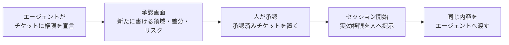
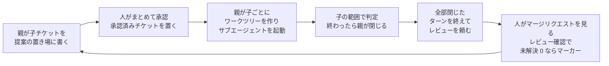

# ccnavi 要件書

## 1. 背景

Claude Code のエージェントは、作業に必要だと判断すると、禁止された操作をどうにか突破して実行しようとする。
「hook が邪魔なので外す」「deny が厳しいので緩める」も、目的を達成しようとするエージェントが普通に選ぶ手である。

既存の防ぎ方には 4 つの穴がある。

- 設定ファイルのパターン一致はコマンドの構造（連鎖・サブシェル・リダイレクト）を見ないため、複合コマンドの後段が素通りする
- プロンプトに書いた禁止は確率を下げるだけで 0 にはならない
- 権限を静的に固定すると、作業ごとに必要な範囲が違うため、広く開けるか毎回確認するかの二択になる。広く開ければ守れず、毎回確認すれば承認が形骸化する
- 拒否の根拠がすべて作業ツリーの中にあり、エージェントが書き換えられる。設定の変更は次のツール呼び出しから効く

ccnavi は「守る対象はプロジェクトが列挙し、それ以外は作業チケットに委譲する」という
分担を成立させ、委譲した先の逸脱を人間の目に触れさせることでこの二択を崩す。

失敗の向きは非対称である。誤検知はエージェントが一手止まるだけで、理由が返れば書き直せる。
素通りは強制の仕組み自体を無意味にし、しかも気づけない。判断がつかないときは拒否にする。
ただし、設定 1 つの破損で回復手段まで奪う形は作らない。

拒否だけでは止まらない。`git push` を禁じられたエージェントは、絶対パスで同じコマンドを打ち直す。
だから拒否と同時に、なぜ止めたかと、代わりに何をすればよいかを名指しで返す。

---

## 2. 外部要求

ccnavi は Claude Code の hook から呼ばれる。1 回の呼び出しは、標準入力で
受け取った JSON を読み、標準出力に応答を返して終わる。実行ファイルは 1 本で、
複数のイベントに同じコマンドとして登録する。

外から縛るのは、期限までに応答が返ること、ガードが無言で消えないこと、
直した設定が次の呼び出しから効くこと、試験の判定が実運用と一致すること。構成の取り方は問わない。

要求の「型」は、その要求がいつ効くかを表す。常時（いつでも成り立つ）、事象（あることが起きたとき）、
状態（ある状態である間）、異常時（望ましくないことが起きたなら）、任意（その機能を使う場合）の 5 つ。

以下の面は、その呼ばれ方で分かれている。

| 面 | 呼ばれ方 |
|---|---|
| 起動と登録 (REQ-HKS) | すべてのイベントに共通 |
| 共通の動作 (REQ-CMN) | すべてのイベントに共通 |
| ルールの注入 (REQ-RUL) | すべてのイベントに共通 |
| ツール実行前の判定 (REQ-PRE) | ツール実行前のイベント |
| 返す文面 (REQ-HNT) | ツール実行前・実行後のイベント |
| ツール実行後の監視 (REQ-PST) | ツール実行後、およびターンの始まりと終わりのイベント |
| 設定ファイルの自己防衛 (REQ-SLF) | ツール実行前・実行後、およびセッション開始のイベント |
| セッション開始時の提示 (REQ-SES) | セッション開始のイベント |
| チケットの承認 (REQ-APV) | セッション開始のイベント、および人が直接起動したとき |
| 実績で測るリスク (REQ-RSK) | 人が直接起動したとき（子を閉じるとき）、およびツール実行後のイベント |
| 診断コマンド (REQ-DIA) | 人が直接起動したときのみ |
| 並行するチケット (REQ-TKT) | ツール実行前・実行後、サブエージェントの開始と終了のイベント、および人が直接起動したとき |
| 複数のリポジトリ (REQ-MLT) | すべてのイベント、および人が直接起動したとき |

登録するイベントの正確な名前と設定ファイルへの書き方は仕様側にある。

### 2.1 起動と登録 — REQ-HKS

| ID | 型 | 要求 |
|---|---|---|
| REQ-HKS-01 | 常時 | ccnavi は、Claude Code の複数の hook イベントに、同一のコマンドとして登録できること |
| REQ-HKS-02 | 事象 | hook から呼ばれたとき、ccnavi は、どのイベントから呼ばれたかを標準入力の内容から判別し、そのイベントに対応する判定だけを行うこと |
| REQ-HKS-03 | 異常時 | もし対応する判定を持たないイベントから呼ばれたならば、ccnavi は、何も判定せず、ツールの実行を妨げずに終わること |
| REQ-HKS-04 | 常時 | ccnavi は、シェルを介さず絶対パスで直接起動でき、利用する側にランタイムやパッケージの追加導入を求めない実行ファイルとして配布できること |
| REQ-HKS-05 | 常時 | ccnavi は、起動時の作業ディレクトリがどこであっても、同じ入力に対して同じ判定を返すこと |
| REQ-HKS-06 | 常時 | ccnavi の判定は、同じイベントに登録された他の hook の結果に依存しないこと |
| REQ-HKS-07 | 異常時 | もし hook の入力を与えられずに直接起動されたならば、ccnavi は、判定を行わず、hook として使う道具である旨と使い方を示して非ゼロの終了コードで終わること |
| REQ-HKS-08 | 常時 | 導入スクリプトは、hook が起動する振り分けのスクリプトと実行ファイルを、それぞれ決まった置き場に置き、置き場を引数で動かせないこと |

REQ-HKS-02 が入力からイベントを判別するのは、登録側に引数で教えさせると、書き間違いが別の判定を無言で走らせるため。

REQ-HKS-03 と REQ-HKS-07 は、設置を誤ったときの落ち方を分ける。知らないイベントに登録されても作業は止めない。
入力なしの直接起動は、黙って 0 を返すと設置の誤りに気づけないので失敗させる。

REQ-HKS-06 は、同じイベントの hook が同時に走り、順序が決まらないことによる。

REQ-HKS-08 が置き場を固定するのは、振り分けのスクリプトが自分の位置から実行ファイルを一意に決め、
自己防衛（REQ-SLF-07）が同じ綴りで両方を守るため。置き場を動かす引数を渡されたときは、黙って無視せず、何も書かずに断る。

### 2.2 共通の動作 — REQ-CMN

| ID | 型 | 要求 |
|---|---|---|
| REQ-CMN-01 | 常時 | ccnavi は、ツールの実行前の判定を行う間、外部プロセスを起動せず、外部ネットワークへ通信しないこと |
| REQ-CMN-02 | 常時 | ccnavi は、判定しない・判定して報告するだけ・判定を適用するの 3 つの動作モードを持ち、モードの指定が無いときは判定を適用するモードで動作すること |
| REQ-CMN-03 | 状態 | 報告するだけのモードである間、ccnavi は、適用するモードと同じ判定を行い、その判定を記録と応答の両方で伝えたうえで、ツールの実行を止めないこと |
| REQ-CMN-04 | 常時 | ccnavi を停止させる指定は、ccnavi を起動した側の環境からのみ効き、プロジェクト内のファイルに書いても効かないこと |
| REQ-CMN-05 | 異常時 | もしモードとして解釈できない値を与えられたならば、ccnavi は、その値を示したうえで、判定を適用するモードで動作すること |
| REQ-CMN-06 | 常時 | ccnavi は、判定した呼び出しのすべてについて、下した判定と、その判定を実際に適用したかどうかを、1 件 1 行の JSON として追記のみの記録に残すこと |
| REQ-CMN-07 | 常時 | ccnavi は、判定しなかった呼び出しについても、判定しなかった理由を同じ記録に残すこと |
| REQ-CMN-08 | 異常時 | もし自身に定めた期限までに判定を終えられないならば、ccnavi は、判定を打ち切り、期限に達したことを理由として拒否側の応答を返すこと |
| REQ-CMN-09 | 状態 | 戻す働きが予行と設定されている間、または報告するだけのモードである間、ccnavi は、作業ツリーのファイルを戻さず、戻していたはずの対象を示すこと |

REQ-CMN-03 が両方で伝えるのは、記録は人が後から数える先、応答はエージェントがその場で読む先だから。

REQ-CMN-05 が値を示すのは、綴りの誤りや名前の変更が意図した選択に見えないようにするため。

REQ-CMN-06 と REQ-CMN-07 は、何を止めるはずだったか・実際に止めたか・判定しなかったかを後から数えられるようにする。

REQ-CMN-08 は、遅延が許可になってしまうことを防ぐ。期限に達すると呼び出し側が応答ごと捨てて素通りになるので、
その手前で自分から拒否にする。外側で打ち切られた場合は 4 章。

REQ-CMN-01 が外部プロセスの起動を禁じるのは、hook がすべてのツール呼び出しで走り、起動のたびに期限に近づくから。
実行前に限るのは、同期の経路にいて遅れが素通りになってしまうのが実行前だけだから。実行後に何を使ってよいかは仕様側が決める。

REQ-CMN-09 は、2 つの戻す働き（REQ-PST-05 のルール由来の保護と、REQ-SLF-02 のコアファイルの保護）に
同じ形で掛かる。組み合わせは次の表になる。

| 動作モード | 戻す働きの設定 | 起きること |
|---|---|---|
| 適用する | 有効 | 戻す。戻した対象を示す |
| 適用する | 予行 | 戻さない。戻していたはずの対象を示す |
| 適用する | 無効 | 戻さない。予行の文も出さない |
| 報告するだけ | 有効 | 戻さない。戻していたはずの対象を示す |
| 報告するだけ | 予行 | 同上 |
| 報告するだけ | 無効 | 戻さない。予行の文も出さない |
| 判定しない | いずれでも | 戻す働き自体が動かない |

戻す働きは 3 値で、予行は判定を本番のまま、戻しだけを止めて何が戻るかを見せる段である。
無効と予行は文面で見分けられること。

### 2.3 ルールの注入 — REQ-RUL

| ID | 型 | 要求 |
|---|---|---|
| REQ-RUL-01 | 常時 | ccnavi は、判定に使うルールを実行ファイルの外にあるファイルから読み込み、ccnavi を作り直さずにルールを追加・変更できること |
| REQ-RUL-02 | 常時 | ccnavi は、ルールの読み込み元を起動時の引数で指定でき、指定が無いときは既定の場所から読み込むこと |
| REQ-RUL-03 | 常時 | ccnavi のルール 1 件は、対象とするツール・照合する条件・一致したときに返す文面を 1 組として持つこと |
| REQ-RUL-04 | 異常時 | もし文面を持たないルールが与えられたならば、ccnavi は、そのルールを受け付けず、どのルールが欠けているかを示すこと |
| REQ-RUL-05 | 常時 | ccnavi のルールは、JSON を含む機械可読な構造化テキストで表現され、書式の版番号を持つこと |
| REQ-RUL-06 | 常時 | ccnavi は、日常の操作を止めるルールを、正規表現を知らなくても書ける記法で受け付けること |
| REQ-RUL-07 | 常時 | ccnavi は、その記法で書けない条件のために正規表現も受け付け、1 件のルールがどちらで書かれているかを取り違えようのない形にすること |
| REQ-RUL-08 | 異常時 | もし解釈できないルールがあるならば、ccnavi は、そのルールを名指しで報告し、そのルールが判定に使われていないことを示すこと |
| REQ-RUL-09 | 常時 | ccnavi は、ワークスペースルートの外を指す条件を、ルートの綴りを書かずにルールファイルから宣言できること |
| REQ-RUL-10 | 異常時 | もしその条件を組み立てられないならば、ccnavi は、そのルールが対象とするツールの呼び出しを、緩むことのない側として扱い、組み立てられなかったことを示すこと |

REQ-RUL-03 と REQ-RUL-04 は、ルールを 1 つ足すたびに「代わりに何をするか」を書かせる仕組みである。

REQ-RUL-06 は、書き損じた正規表現が誰の目にも留まらない穴になるのを減らす。REQ-RUL-07 は、
正規表現を使ったルールが一目で分かり、書いた人の意図と ccnavi の解釈が黙って食い違わないようにする。

REQ-RUL-08 は、防御が抜けたことに気づけるようにする。

REQ-RUL-09 は、ワークスペースルートの綴りが機械ごとに違うため。

REQ-RUL-10 は REQ-RUL-08 より強い。ワークスペースの外を指す条件が抜けると、守られない範囲が外の全部に
広がるので、報告だけでは足りない。ほかの壊れ方は REQ-RUL-08 のままである。

### 2.4 ツール実行前の判定 — REQ-PRE

| ID | 型 | 要求 |
|---|---|---|
| REQ-PRE-01 | 事象 | ツールの呼び出しが発生したとき、ccnavi は、その呼び出しを許可・確認・拒否のいずれかに判定し、Claude Code が解釈できる応答として返すこと。ただし設定がその対象に言及していない呼び出しについては、REQ-PRE-10 に従う |
| REQ-PRE-02 | 常時 | ccnavi は、プロジェクト設定が拒否と宣言した対象への操作を、チケット・環境変数・過去の確認の記憶のいずれによっても許可しないこと |
| REQ-PRE-03 | 常時 | ccnavi は、プロジェクト設定が確認と宣言した対象への操作を、人間の確認を経ずに実行させないこと |
| REQ-PRE-04 | 異常時 | もし操作の対象を一意に確定できないならば、ccnavi は、その操作を許可としないこと |
| REQ-PRE-05 | 常時 | ccnavi は、自身の設定・承認済みチケット・レビュー済みのマーカーを、エージェントの操作によって書き換えさせないこと |
| REQ-PRE-06 | 異常時 | もし設定を読み取れないならば、ccnavi は、組み込みの既定で判定を続け、既定を使ったことを示したうえで、読み取りと設定自身の修復を妨げないこと |
| REQ-PRE-07 | 状態 | 利用者がある操作を確認のうえ許可して以降、ccnavi は、同一セッション内で同じ根拠による確認を繰り返さないこと。ただし設定が確認を宣言した対象を除く |
| REQ-PRE-08 | 状態 | 人間に確認できないセッションである間、ccnavi は、確認が必要な操作を許可しないこと。ただし設定がその対象に言及していない呼び出しについては、プロジェクトの設定が委ねると宣言している間を除く |
| REQ-PRE-09 | 常時 | ccnavi は、ある呼び出しへの判定を、その呼び出しの内容だけから決め、その呼び出しを引き起こしたテキストの出どころによって変えないこと |
| REQ-PRE-10 | 状態 | 設定がその対象に言及していない間、ccnavi は、その呼び出しについて自身の判定を返さず、扱いを Claude Code の権限モードに委ね、委ねたことを記録に残すこと。ただし REQ-PRE-04 と REQ-PRE-08 に該当する呼び出しを除く |
| REQ-PRE-11 | 事象 | 当たったルールがモデルへ渡す文（`additionalContext`）を持つとき、ccnavi は、判定が許可・確認・拒否のいずれであっても、またモードが判定に手を出さないものであっても、その文を判定とは別の経路でモデルに届けること。文を持たないルールでは何も足さないこと。ルールが「1 度だけ渡す文」（`additionalContextOnce`）を持つなら、その文は同じ文脈（セッション、サブエージェントはその起動ごと）では最初に当たったときだけ届け、セッションの開始のたびに改めて届けること。両方の文を持つルールでは、初回は両方を、2 回目からは毎回渡す文だけを届けること |
| REQ-PRE-12 | 事象 | ルールがモデルへ渡すファイル（`additionalContextFile` / `additionalContextOnceFile`）を持つとき、ccnavi はそのファイルの本文を対応する文の後ろに並べて届けること。探す先は行き先のワークツリー、その元リポジトリ、ワークスペースルートの順とし、最初に在ったものを読むこと。無ければ何も足さないこと。読むのはワークスペースの中だけとし、絶対パスと上に出るパスは読まないこと。本文は固定の上限で切り、切ったときはそのことと続きの在りかを本文の末尾に添えること |
| REQ-PRE-13 | 常時 | シェルのコマンドが実行役のコマンド（環境変数の代入、`env`・`sudo`・`timeout` など、`sh -c` の文字列、`xargs`・`find -exec` の後ろ）を通して実行される場合、ccnavi は、拒否と確認のルールとサブエージェントの禁止を、中で実行されるコマンドにも当てること |
| REQ-PRE-14 | 常時 | ccnavi は、中で実行されるコマンドに、許可のルールと、止めている間でも通す形を当てないこと |
| REQ-PRE-15 | 事象 | 中で実行されるコマンドでルールに当たったとき、ccnavi は、当たった中で実行されるコマンドを記録に残し、返す文面ではそれを実行した実行役のコマンドとともに示すこと |
| REQ-PRE-16 | 常時 | シェルのコマンドが作業ディレクトリを移したうえで引数やリダイレクトの行き先を綴る場合、ccnavi は、移った先から見た綴りにも拒否と確認のルールとサブエージェントの禁止を当て、許可のルールと止めている間でも通す形には当てないこと。行き先が綴りから決まらない場合は、移った先を当てる先に足さないだけとし、書かれた綴りに対する判定は変えないこと |

REQ-PRE-02 と REQ-PRE-03 が信頼境界である。設定は人が管理するので信頼し、チケットはエージェントが書くので信頼しない。
チケットの宣言は権限を絞ることしかできない。REQ-PRE-05 が無いと、この境界はチケットを書き換えるだけで消える。

REQ-PRE-06 は REQ-PRE-04 の例外にあたる。拒否にすると、壊れた設定を直す操作まで止まって回復できなくなる。

REQ-PRE-10 は、ccnavi が判定を持たない呼び出しに確認を上乗せしても、同じ呼び出しで 2 度聞かれるだけだから。
除外の 2 つはどちらも許可にしないためのもので、REQ-PRE-04 は確定できなかった事実が委ねた先に伝わらず、
REQ-PRE-08 は確認に答える者が居ない。REQ-PRE-08 の除外をプロジェクトの設定に開いても、REQ-PRE-04 の除外は残る。
委ねた回の記録は、設定のどこが薄いかを数える手立てになる。

REQ-PRE-09 は、hook の入力に出どころが書かれておらず、出どころを理由にした例外は注入された文からも名乗れるため。
REQ-PRE-07 の確認の記憶は人が明示的に許可した事実を根拠にするので、これに反しない。

REQ-PRE-11 が判定と別の経路で届けるのは、通す呼び出しにも「これを踏まえて進めろ」を言えるようにするため。
報告するだけのモードでも届ける。

REQ-PRE-13 は、先頭の語に固定したルールやサブエージェントの禁止が `env rm …` のような形で外れるのを防ぐ。
取り出す実行役のコマンドは組み込みの一覧だけで、ルールファイルから足せない（REQ-SLF-04 と同じ向き）。

REQ-PRE-14 は REQ-PRE-13 の向きを限る。止める側は当て先を足すだけなので元の形より緩くならないが、
許す側に当てると、`sudo -u me cat …` が中の `cat …` の許可で通るように緩む。

REQ-PRE-15 は、元の形だけを見た読み手に当たった箇所を示すため。中で実行されるコマンドで当たった理由には、
REQ-HNT-04 の断りを付けない。

REQ-PRE-16 は、`cd .claude && echo x > settings.json` のように、移った先の名前が綴りから消える形を塞ぐ。
移った先から見た綴りは書かれた綴りに足すだけなので、行き先を読み違えても当たるはずのものは外れない。
行き先が読めないときも REQ-PRE-04 の扱いにしない。そうすると生の文字列に当てることになり、
`cd - && rm -f <守られた場所>` のように書かれた綴りでは止まる形が止まらなくなる。

### 2.5 返す文面 — REQ-HNT

| ID | 型 | 要求 |
|---|---|---|
| REQ-HNT-01 | 事象 | 1 回の呼び出しを判定したとき、ccnavi は、該当したすべての拒否と確認の理由を 1 回の応答にまとめて返すこと |
| REQ-HNT-02 | 常時 | ccnavi が返す理由は、対象・理由コード・根拠となった設定の出所を含み、他の判定の結果に言及せずそれだけで読んで成立すること。出所はルールの識別子で名乗ること。識別子を持たないルールに限り、代わりにルールファイルを名乗ること |
| REQ-HNT-03 | 常時 | ccnavi は、拒否した操作に代替手段があるときその手段を名指しで示し、代替が無いときは無いことを示すこと |
| REQ-HNT-04 | 常時 | ccnavi は、判定の材料が揃わずに拒否にしたとき、宣言された禁止に当たった場合とは異なる文面で、判定を妨げた箇所を示すこと |

REQ-HNT-04 は、文書に禁止語を書いただけで止まった読み手に、判定を妨げた箇所を示して次の一手
（別の道具に切り替える・本文をファイルへ逃がす）へ導くため。

REQ-HNT-02 は、同じ出来事に複数の判定が同時に走り、どれが利用者に見えるかが決まらないため。

### 2.6 ツール実行後の監視 — REQ-PST

| ID | 型 | 要求 |
|---|---|---|
| REQ-PST-01 | 事象 | ツールの実行が完了したとき、ccnavi は、プロジェクト設定が書き込み拒否、または実行前の確認と宣言した領域のファイルが変更されていないかを検証すること |
| REQ-PST-02 | 事象 | 保護領域の変更を検知したとき、ccnavi は、変更されたファイル・該当する設定・原因となった直前の実行を、エージェントに届く差し戻しの文として返すこと |
| REQ-PST-03 | 事象 | 保護領域の変更を検知したとき、ccnavi は、その変更を元に戻す手順を対象ごとに示すこと |
| REQ-PST-04 | 事象 | 保護領域の変更を検知したとき、ccnavi は、その実行を許可した確認の記憶を無効にし、以降の同じ操作で再び確認が発生すること |
| REQ-PST-05 | 任意 | 自動復元が有効である場合、ccnavi は、検知した変更のうち書き込み拒否と宣言した領域のものを元に戻し、戻した対象を示すこと。戻さなかったものについては、戻さないことと、その判断が誰のものかを示すこと |
| REQ-PST-06 | 事象 | 利用者の依頼が届いたとき、ccnavi は、そのときの保護領域の状態と、監視する作業ツリーごとの履歴の位置を控え、以降をそこからの差分として扱えるようにすること |
| REQ-PST-07 | 事象 | エージェントが応答を終えたとき、ccnavi は、REQ-PST-06 の控えに無い保護領域の変更を、モデルではなく利用者へ示すこと。控えた位置より後に履歴へ入った変更も含めること。控えを持たない場合は示さず、作業ツリー単位で控えを持たないときは、そのツリーを数えていないことを示すこと |

実行後の監視は実行後に走り、操作そのものを取り消せないので、REQ-PST-02 は差し戻しの文を返す。

ccnavi 自身の副命令（`ticket start` / `finish` / `cancel` と `review request` / `confirm` / `ready`）が
承認済みチケットとフェーズのマーカーの置き場に書いたぶんは、内容で判断して REQ-PST-01 の検証から外す（ADR-0075）。
外すのは、副命令がまだ書いていない欄が足されただけのもの、範囲を宣言しないファイル、1 対 1 で対になった
閉じる向きの移動の 3 つに限る。承認された作業範囲（チケットが宣言する allow / ask / deny、親、フェーズ）が
変わったものは、どの経路から書かれても検証する。REQ-APV-05 / REQ-APV-07 と REQ-RSK-01 の
「エージェントが書けない場所」は、実行前の判定が第 1 線、実行後の監視が引数に現れない経路に対する第 2 線になる。

REQ-PST-01 が見るのは拒否と確認の両方で、REQ-PST-05 が戻すのは拒否のぶんだけ。確認と宣言した領域、
承認された作業範囲の外、履歴に入った変更は戻さない。

REQ-PST-07 の宛先が利用者なのは、REQ-PST-02 が既にモデルへ届いているため。REQ-PST-06 の控えは、
利用者の書きかけや他のセッションの変更をこのターンの成果として並べないため。控えを持たないときは、
見えていない期間を見えたことにしない。

REQ-PST-01 の保護領域はプロジェクト設定の宣言から導くので、宣言そのものが書かれたファイルは実行後の監視では守れない。
そこは REQ-SLF が受け持つ。

### 2.7 設定ファイルの自己防衛 — REQ-SLF

| ID | 型 | 要求 |
|---|---|---|
| REQ-SLF-01 | 事象 | ツールが実行される前、ccnavi は、自身の判定と起動が依存する設定ファイルの内容を控えること |
| REQ-SLF-02 | 事象 | ツールの実行が完了したとき、ccnavi は、控えた内容と現在の内容を突き合わせ、異なる場合は控えた内容へ戻し、戻した対象を示すこと |
| REQ-SLF-03 | 状態 | 対象が存在しない間、ccnavi は、控えまたはバージョン管理から復元を試み、いずれも持たない場合はその対象を保護の対象から外すこと |
| REQ-SLF-04 | 常時 | ccnavi は、自己防衛が守る対象を、プロジェクトが書いたルールから導かないこと |
| REQ-SLF-05 | 任意 | 自己防衛が無効である場合、ccnavi は、控えも復元も行わず、REQ-SLF-06 の拒否も行わないこと |
| REQ-SLF-06 | 状態 | 自己防衛が有効である間、ccnavi は、対象の設定ファイルへシェル経由で書き込む呼び出しを、プロジェクトのルールにその宣言が無くても拒否すること |
| REQ-SLF-07 | 状態 | 自身の実行ファイルの位置が設定されている間、ccnavi は、それを守る対象に含め、シェル経由の書き込みと名指しのツールによる書き込みの両方を拒否すること |
| REQ-SLF-08 | 事象 | セッションが開始されたとき、ccnavi は、ツール呼び出しごとに控えるには大きすぎる対象を、そこで 1 度だけ控えること |
| REQ-SLF-09 | 事象 | 保護済みのスクリプトを呼ぶシェルのコマンドが、スクリプトの検査の材料を変える環境変数（出力の量と待ち時間だけを変えるものを除く）を同じコマンド行で置く・外すとき、ccnavi は、それを拒否すること |

REQ-SLF-04 は、ルールを空にされた時点で守る対象が 0 件になるのを防ぐ。守りの根拠を守られる対象の外に置く。

REQ-SLF-07 が実行ファイルを含めるのは、差し替えるとルールを変えずに判定を入れ替えられるため。実行ファイルは
バージョン管理の外にあることが多く、控えだけが戻す手段になる。位置が設定されているときだけ守るのは、推測した
綴りの先にある別のファイルを実体として扱わないため。位置が振り分けのスクリプトを指すときは、そのスクリプトが
起動する実行ファイルの置き場も守る。

REQ-SLF-08 は、実行ファイルがツール呼び出しごとに写すには大きいため。作り直すのは人の作業なので、セッションに 1 度でよい。

REQ-SLF-06 が止めるのが本筋で、REQ-SLF-02 の戻しは止めきれなかったぶんの受け皿である。

REQ-SLF-03 は、設定ファイルを置いていないことが正常な状態だから。

実行前にも見るのは、hook の登録を消されると実行後のイベント自体が発火しなくなるため。
実行前の登録ごと消された場合は 4 章。

### 2.8 セッション開始時の提示 — REQ-SES

| ID | 型 | 要求 |
|---|---|---|
| REQ-SES-01 | 事象 | セッションが開始されたとき、ccnavi は、無確認で書き込める領域・確認付きで書き込める領域・使えないツールを利用者に示すこと |
| REQ-SES-02 | 事象 | チケットの要求が上位の設定によって却下されたとき、ccnavi は、却下された要求・理由・却下した設定の出所を利用者に示すこと |
| REQ-SES-03 | 事象 | チケットが想定作業範囲の外へ許可を与えたとき、ccnavi は、それを却下された要求と区別し、先に読む位置へ置いて示すこと |
| REQ-SES-04 | 事象 | セッションが開始されたとき、ccnavi は、同じ内容をエージェント側にも渡し、使えない権限とその代替手段を伝えること |
| REQ-SES-05 | 状態 | ccnavi 自身または設定が承認された内容と異なる間、ccnavi は、その差分を示し、承認されるまで許可を与えないこと |

REQ-SES-03 は、却下された要求は実害が出ないが、想定外に許可された権限は実際に使われるため。

### 2.9 チケットの承認 — REQ-APV

| ID | 型 | 要求 |
|---|---|---|
| REQ-APV-01 | 事象 | チケットの承認を求められたとき、ccnavi は、そのチケットによって新たに無確認で書き込めるようになる領域を、提示の最初に置くこと |
| REQ-APV-02 | 事象 | チケットの承認を求められたとき、ccnavi は、前回承認されたチケットからの権限の差分と、人間レビューの要否と、計画を示すこと |
| REQ-APV-03 | 常時 | ccnavi は、チケットが宣言した範囲の広さでリスクの点を付けないこと。リスクは子チケットを閉じるときに実績の差分で測ること（REQ-RSK） |
| REQ-APV-04 | 状態 | 現在のチケットの内容が承認された内容と一致しない間、ccnavi は、そのチケットが与える許可をすべて確認以上の厳しさにすること |
| REQ-APV-05 | 事象 | チケットが承認されたとき、ccnavi は、承認された内容を、エージェントが書き換えられない場所に残すこと。承認の経路が時刻と提案の出所を持つなら、それも同じ場所に残すこと（置き場を動かす経路は持たない。REQ-APV-07） |
| REQ-APV-06 | 事象 | 承認の対象を識別子で絞るよう求められたとき、ccnavi は、対象を狭めるだけで、絞らないときに承認されないものを承認しないこと。承認待ちに無い識別子、親や親の改版が承認待ちなのに対象に無い子が含まれていれば、何も承認しないこと |
| REQ-APV-07 | 常時 | ccnavi は、承認を人が押したことの証拠を求めること。端末から求められた承認は標準入力が端末であることを、画面から求められた承認は見せた一覧と現在の一覧が一致し、見せた中身の指紋も一致すること（REQ-APV-09）を条件とし、一致しなければ何も承認しないこと。承認済みチケットの置き場に在ること自体を 3 つめの証拠として認め、その置き場へエージェントが書けないことをもって成り立たせること。エージェントがシェルから承認の経路を起動することは、どの形でも拒むこと |
| REQ-APV-08 | 事象 | チケットが承認されたとき、ccnavi は、そのことを次にモデルへ渡す機会に 1 度だけ伝えること。伝える対象は、その文脈が知る前に置かれた承認済みチケットを除いた、新しく置かれた承認済みチケットと内容の変わった承認済みチケットとすること |
| REQ-APV-09 | 事象 | 利用者が VS Code 拡張のボードで承認したとき、ccnavi は、見せた中身（承認画面の本文と、承認済みチケットとして書き出す中身）と承認のときに読み直した中身が一致するときだけ承認済みチケットを置くこと。一致しないとき、または見せた中身を照合する値が渡されないときは、何も承認しないこと |
| REQ-APV-10 | 事象 | 利用者が VS Code 拡張のボードで承認したとき、ccnavi は、承認済みチケットをコミットして push する手順を利用者の端末に渡すこと |
| REQ-APV-11 | 事象 | エージェントが承認済みチケットをコミットして push する sh を実行しようとしたとき、ccnavi は、それを止めること |
| REQ-APV-12 | 事象 | エージェントが承認の経路の sh を実行しようとしたとき、ccnavi は、綴りの大文字小文字によらずそれを止めること |
| REQ-APV-13 | 事象 | 承認できる状態かを確かめるよう求められたとき、ccnavi は、承認済みチケットを置かずに、承認の対象に入るものと入らないもの、入らない理由（絞りそのものが通らないときはその理由）を示し、指定されたもの（指定が無ければ承認待ち全部）がそのまま承認の対象に入るかどうかを終了コードで返すこと。答えの終了コードは、使い方と設定の誤りを表すものと分けること。承認が落とさないものでは落とさず、確かめの答えと承認の結果を食い違わせないこと |
| REQ-APV-14 | 事象 | エージェントが承認待ちの置き場に提案を書こうとしたとき、ccnavi は、その呼び出しの判定を変えずに、承認を依頼する前に確かめる手立て（REQ-APV-13）を 1 つの文脈につき 1 度伝えること |

REQ-APV-02 の「前回承認されたチケット」は、子チケットでは親チケットを指す。子の承認画面が示す差分は、
親の範囲をどこまで絞ったかになる。

REQ-APV-05 が求めるのは、エージェントが書き換えられないことと、承認した時点の内容が残ることの 2 つ。
並行するチケット（REQ-TKT）ではチケット 1 本ごとの承認済みチケットで満たす（ADR-0023）。

REQ-APV-07 の「画面から求められた承認」は VS Code の拡張を指す。拡張の子プロセスは端末を持たないので、
人に見せたものとこれから承認するものが同じことを証拠にする。3 つめの「置き場に在ること」は、端末もボードも
持たない人のための経路（ADR-0058）。この経路は承認の画面を通らないので、承認のときの検査
（REQ-TKT-06、REQ-MLT-11）は判定の側が当て、止まっているものは検証（REQ-DIA-06 の `blocked`）が示す。

REQ-APV-08 は、画面で承認すると承認とセッションが離れ、伝えないと人が「承認した」と打つまで作業が止まるため。

REQ-APV-13 が終了コードで返すのは、読む相手がエージェントだから。見せる枝（REQ-DIA-10）と分けるのは、
それを読む VS Code のボードが 0 以外を失敗として扱うため。承認が落とさないのは範囲の超過と読めない提案で、
どちらも本文で名指しする。承認待ちが 1 件も無いときだけは答えが違い、承認は「することが無い」で通り、
確かめは「いいえ」を返す。

REQ-APV-14 の文は判定ではないので、ルールの表に載せない（ADR-0059）。1 度に限るのはコンテキストを食わないため。

### 2.9.1 実績で測るリスク — REQ-RSK

| ID | 型 | 要求 |
|---|---|---|
| REQ-RSK-01 | 事象 | 子チケットを閉じようとしたとき、ccnavi は、その子のワークツリーの基準点から HEAD までの差分を数えて点とそのリスクレベルを出し、エージェントが書き換えられない場所に残すこと |
| REQ-RSK-02 | 常時 | ccnavi は、点の配点を保護された設定ファイルから読み、無ければ組み込みの配点で、壊れていれば組み込みの配点に戻ってそのことを示すこと。リスクレベルの名前は固定で、境目の点だけを設定で変えられること |
| REQ-RSK-03 | 常時 | 配点の項目は、差分の量（行数・ファイル数・消したファイル数・触ったパス）、保護された場所に置かれたスクリプトの出力、サブエージェントが判断して親が記録する定性の問い、の 3 系統を持てること。スクリプトが測れなかった項目は、その項目の点を加えて示すこと |
| REQ-RSK-04 | 状態 | 定性の項目の判定が子の現在の HEAD に対して揃っていない間、ccnavi は、その子を閉じさせず、問いと差分の要約を親に示すこと。判定を記録できるのは親だけで、サブエージェントには許さないこと |
| REQ-RSK-05 | 状態 | フェーズの点（子の最大値）が高いリスクレベル以上である間、ccnavi は、種類や子の宣言がレビュー不要でも、そのフェーズを人間レビューが要る扱いにすること。実績が小さいことを理由に宣言のレビュー要を下げないこと。レビューをどこで受けるかは指さず、宣言が「見ない」だったフェーズだけをこのセッションで見る扱いに上げ、マージリクエストで見ることを勧める文を添えること |
| REQ-RSK-06 | 事象 | 子を閉じたとき・フェーズが終わったとき・診断を求められたとき・レビューを依頼するとき、ccnavi は、点・リスクレベル・加点した理由を示すこと |

### 2.10 診断コマンド — REQ-DIA

| ID | 型 | 要求 |
|---|---|---|
| REQ-DIA-01 | 事象 | 実効権限の表示を求められたとき、ccnavi は、現在の設定・チケット・環境変数から決まる読み・書き・実行それぞれの許可を、判定を行わずに一覧すること |
| REQ-DIA-02 | 事象 | ツールと対象を与えて試験を求められたとき、ccnavi は、操作を実行せずに判定結果とすべての理由を返すこと |
| REQ-DIA-03 | 常時 | ccnavi が試験で返す判定は、同じ入力に対して実運用で返す判定と一致すること |
| REQ-DIA-04 | 事象 | 設定の検証を求められたとき、ccnavi は、防御を無効化しうる記述を error と warn に分けて報告し、error があれば非ゼロの終了コードで終わること |
| REQ-DIA-05 | 事象 | 確認の記憶の表示または消去を求められたとき、ccnavi は、保持している対象を一覧し、消去後は同じ操作で再び確認が発生すること |
| REQ-DIA-06 | 事象 | チケットの状態の機械可読な一覧を求められたとき（`--explain --json`）、ccnavi は、提案・承認済みチケット・マーカー・レビューで止まっているか・書き込みが止まっているか・ワークツリーの有無・承認待ちを、判定と同じ関数で求めた値として JSON で返し、その際にネットワークへ出ないこと |
| REQ-DIA-07 | 常時 | 機械可読な一覧と設定の検証が、チケット制御を使っているかどうかを示すこと。VS Code の拡張は、ワークスペースの設定ファイルに書かれたその宣言が `disable` のとき、チケットの入口（サイドパネルとコマンド）を出さず、ルールの入口だけを出すこと |
| REQ-DIA-08 | 事象 | 設定の検証を機械可読な形で求められたとき（`--lint --json`）、ccnavi は、人向けの文面と同じ苦情を同じ深刻度で JSON として返し、終了コードも人向けの文面のときと同じにすること |
| REQ-DIA-09 | 事象 | 診断（試験・見本・検証・実効権限の表示）で 1 つのプロジェクトのルールファイルの差し替え（`--project-rules-file <名前>=<パス>`）を与えられたとき、ccnavi は、その名前のプロジェクトのルールとして差し替え先のファイルを読むこと。層のフェーズの種類の差し替え（`--project-phases-file <名前>=<パス>`、名前は `self` かプロジェクト）を与えられたときも同じく、その層の種類として読み、共通層の種類と合成して検証すること。hook からの判定では差し替えを無視し、守る対象（REQ-MLT-08）は本来の場所のままとすること |
| REQ-DIA-10 | 事象 | 承認の対象の機械可読な提示を求められたとき（`--approve --preview --json`）、ccnavi は、承認の対象・承認画面の本文・承認の対象にしない提案とその理由・読めない提案を JSON で返し、承認済みチケットを置かないこと。承認の対象は承認が使うのと同じ関数で求めること |

診断コマンドは hook から呼ばれず、人が端末から打つ。REQ-DIA-06、REQ-DIA-02 の JSON 版
（`--test --json` / `--test-samples --json`）、REQ-DIA-08 は VS Code の拡張（`vscode-extension/ccnavi-board/`）も読む。
拡張は判定の答えを自前で出し直さず、実行ファイルが出したものを並べる。

REQ-DIA-03 が無いと、報告するだけのモードや試験の結果が、判定を適用するモードの保証にならない。

### 2.11 並行するチケット — REQ-TKT

複数のチケットが、それぞれ別のワークツリー（git worktree）で同時に進む。
メインエージェントが親チケットの下に子チケットを複数書き、サブエージェントが
子を 1 本ずつ実行する。子はフェーズというまとまりに分かれ、フェーズの終わりで人がレビューする。

| ID | 型 | 要求 |
|---|---|---|
| REQ-TKT-01 | 常時 | ccnavi は、書き込みの対象が行き着く先の属するワークツリーから、その呼び出しに適用するチケットを決めること。呼び出し元の作業ディレクトリや、呼び出したエージェントの素性によって変えないこと |
| REQ-TKT-02 | 常時 | ccnavi は、ワークツリーの名前とチケットの識別子が一致するものだけを結び付け、チケットの範囲をそのワークツリーのルートからの相対として解き、その範囲の `glob` と `regex` を機械によらず大文字小文字を区別せずに照合すること |
| REQ-TKT-03 | 状態 | チケットに結び付くワークツリーが存在しない間、ccnavi は、そのチケットの許可を効かせないこと |
| REQ-TKT-04 | 常時 | ccnavi は、子チケットの範囲が親チケットの範囲を超えていれば承認の画面でそれを示し、判定では親チケットの範囲の外への書き込みを止めること |
| REQ-TKT-05 | 常時 | ccnavi は、親と子の判定が異なる対象について、厳しい側の判定を使うこと |
| REQ-TKT-06 | 常時 | ccnavi は、親子の深さを 2 段に限り、子を親に指定したチケットを承認の対象にしないこと。承認の画面を経ずに承認済みチケットの置き場に置かれたものにも同じ検査を判定のときに当て、当たれば範囲を当てずにそのワークツリーへの書き込みを全部拒否すること |
| REQ-TKT-07 | 常時 | ccnavi は、子チケットの識別子を親の識別子と連番の組に限り、別の親の子と衝突しない形にすること |
| REQ-TKT-08 | 事象 | チケットの承認を求められたとき、ccnavi は、主となるワークツリーとすべてのワークツリーの提案の置き場を走査し、未承認のチケットを、それぞれの人間レビューの要否と理由とともに一度に示すこと |
| REQ-TKT-09 | 常時 | ccnavi は、チケットの状態を置き場で表すこと。提案の置き場に承認待ちとレビュー待ち、承認済みチケットの置き場に作業中と閉じた（取り消しを含む）の 4 つとし、チケットは 1 本のファイルとしてその間を動くこと。承認済みチケットの置き場へ動かすのは人の操作（承認・レビュー済み・受け入れ・締め、および人がファイルを直接動かすこと）に限り、レビュー待ちの置き場への直接の作成と移動を、エージェントの素性によらず拒否すること |
| REQ-TKT-10 | 常時 | ccnavi は、チケットの状態を動かす操作をサブエージェントに許さないこと |
| REQ-TKT-11 | 事象 | チケットが着手されたとき、ccnavi は、開始の時刻と差分の基準点を記録し、以後そのワークツリーの範囲外の検査を、基準点以降のコミット済みの差分と未コミットの変更の両方に対して行うこと |
| REQ-TKT-12 | 事象 | 承認済みのチケットが作業中の置き場から出たとき（レビュー待ち・閉じた・取り消し）、ccnavi は、人の承認を経ずにそのチケットの許可を効かせなくすること。再び効かせるのは人の操作によること |
| REQ-TKT-13 | 事象 | 同じ親の同じフェーズに属する子チケットがすべて閉じられ、そのフェーズに人間レビューが要るとき、ccnavi は、エージェントに、成果を親へ合流させ、ターンを終えて利用者を待つよう伝えること。見る場所がマージリクエストなら push とレビューの依頼を、このセッションなら利用者に差分を見てもらうことと、先へ進めるのが人の直接起動であることを伝えること |
| REQ-TKT-14 | 事象 | 同じ親の同じフェーズに属する子チケットがすべて閉じられ、人間レビュー要のものが 1 枚も無いとき、ccnavi は、人間レビューを省略して進むことをエージェントに伝え、省略した事実を残すこと |
| REQ-TKT-15 | 状態 | 人間レビュー要のフェーズが終わり、そのフェーズにレビュー済みのマーカーが無い間、ccnavi は、サブエージェントの起動と、チケットの状態を動かす操作・レビューの依頼と確認・git のラッパースクリプト以外のシェル実行を拒否し、理由に利用者への問い合わせを入れること |
| REQ-TKT-16 | 事象 | レビューの依頼を求められたとき、ccnavi は、フェーズが終わっていること・そのフェーズの子ブランチがすべて親ブランチに取り込まれていること・未コミットの変更が無いこと・push 済みであること（どちらも提案と承認済みチケットの置き場は数えない）・そのフェーズのレビューが延期されていないこと・そのフェーズがレビュー済みでないこと・まだ依頼していないこと（依頼の後に親ブランチの HEAD が動いていれば依頼し直せる。提案と承認済みチケットの置き場だけを変えたコミットは動いたと数えない）を確かめ、1 つでも欠ければ全件を示して依頼せず、満たせば対応するマージリクエスト（無ければ下書きで作る）に依頼を投稿し、依頼の時点を記録すること |
| REQ-TKT-17 | 事象 | レビューの確認を求められたとき、ccnavi は、依頼の記録が無ければ拒み、あれば、いま解決されていないスレッド（ccnavi 自身の投稿と人が受け入れたものを除く）と、レビュアーごとの最新のレビューを数え、変更要求のレビューが無く未解決のスレッドも無ければレビュー済みのマーカーを置き、そのフェーズ（延期を引き受けた分を含む）のレビュー待ちのチケットを閉じた置き場へ動かし、あればマーカーを置かずにその一覧を示すこと。依頼の時点より後かどうかでスレッドを除かないこと |
| REQ-TKT-18 | 事象 | 未解決のスレッドの扱いを求められたとき、ccnavi は、人が直接起動したとき（端末）か、人がボードで見せた一覧に対して押したとき（見せた指摘と今の指摘の指紋が一致するとき）に限りそれを受け付け、未解決の指摘を 1 件ずつ示して、それぞれの行き先を選ばせること。行き先は、対応しない（受け入れの控えに足す）、このフェーズで直す（同じフェーズの番号で、見た子の範囲の和と直す指摘の一覧を持つ子を承認済みチケットの置き場に直に置き、そのフェーズのマーカーを消す）、課題に回す（受け入れの控えに足し、その指摘を載せた課題を作る。フィードバック計画が承認されたあとに限る）の 3 つ。直す指摘が無ければレビュー済みのマーカーを置くこと。どちらでもレビュー待ちのチケットを閉じること。続きの子は人が選んだことで承認されたものとし、別の承認を求めないこと。ボードの経路の形をエージェントがシェルから打つことは止めること |
| REQ-TKT-19 | 状態 | 変更要求のレビューが立っている間、ccnavi は、人の直接起動によってもレビュー済みのマーカーを置かないこと |
| REQ-TKT-20 | 事象 | チャットで受けた承認や判断の書き写しを求められたとき、ccnavi は、それをマージリクエストの通常のコメントとして投稿し、レビューの状態を変えないこと |
| REQ-TKT-21 | 事象 | 終わったフェーズに子チケットが新たに承認されたとき、ccnavi は、そのフェーズの依頼・レビュー済み・省略のマーカーを消すこと |
| REQ-TKT-22 | 事象 | サブエージェントが親または子のワークツリーで開始されたとき、ccnavi は、そのワークツリーに関わる承認済みで閉じていない子チケットの識別子・ワークツリー・範囲・先行チケットの状態をサブエージェントに渡すこと。主となるワークツリーやチケットの無いワークツリーでの開始には渡さないこと |
| REQ-TKT-23 | 事象 | サブエージェントが終了しようとしたとき、そのワークツリーに範囲外の変更（基準点以降のコミット済みの差分または未コミットの変更）が残っていれば、ccnavi は、1 回に限りそれを示して終了を差し戻すこと |
| REQ-TKT-24 | 常時 | ccnavi は、提案の置き場と承認済みチケットの置き場を設定で差し替えられ、承認済みチケットの置き場が保護されていないときはそれを診断で示すこと |
| REQ-TKT-25 | 事象 | 設定の検証を求められたとき、ccnavi は、チケットの無いワークツリー・識別子と名前の一致しないワークツリー・識別子の形が規約に合わない子・同じ識別子が複数の置き場にあるもの・先行が閉じていないのに作業中の子・読まれない場所に置かれた承認済みチケット・無い認証情報・ワークツリーでも主でもないのに設定ディレクトリを持つディレクトリ・下書きの置き場に追跡されているファイルがあるリポジトリと、その置き場が git で無視されていないリポジトリ（ワークスペースと各プロジェクトのそれぞれ）を示すこと |
| REQ-TKT-26 | 常時 | ccnavi は、フェーズの種類（識別子・表示名・作業かフィードバック対応かの別・人がどこで見るか（見ない・このセッション・マージリクエスト）・範囲の上限・成果物・並行してよい種類・一緒に要る種類・先に済んでいるべき種類）と、全体計画の待ち方（一直線か DAG か）を、保護された設定ファイルから読むこと。識別子か表示名が重なる定義は誤りとして示すこと。フィードバック対応の種類に「見ない」を許さないこと |
| REQ-TKT-27 | 常時 | 親チケットが全体計画（作業フェーズの種類の並び）とフィードバック計画（フィードバック対応フェーズの種類の並び）を持てること。全体計画に作業以外の種類、フィードバック計画にフィードバック対応以外の種類があれば承認を拒むこと |
| REQ-TKT-28 | 常時 | 計画の項でレビューを延期できること。延期したフェーズの終わりでは進行を止めず、一直線なら次の延期していないフェーズ、DAG なら延期したフェーズを待つ後ろのフェーズのうち延期していない最初のものの依頼に、延期した分を含めること。計画の最後の項とレビュー不要の種類は延期できないこと |
| REQ-TKT-29 | 事象 | 子チケットの承認を求められたとき、その番号が待つフェーズ（一直線ならその番号より前の全部、DAG なら種類の祖先に当たる前の番号）が全部閉じ、レビュー（延期でなければ）が済んでいなければ、ccnavi は、承認を拒むこと。並行してよいと定義された種類の組は除く。フィードバック計画はいつも一直線で待たせること |
| REQ-TKT-30 | 常時 | 子チケットの範囲が、そのフェーズの種類の範囲の上限を超えていれば、ccnavi は、承認の画面でそれを示し、判定ではその上限の外への書き込みを止めること |
| REQ-TKT-31 | 事象 | フェーズの最後の子を閉じようとしたとき、種類の成果物が親または子のワークツリーに在って追跡されていなければ、ccnavi は、閉じるのを拒み、無いものを示すこと |
| REQ-TKT-32 | 常時 | 親チケットの改版で変えられるのは計画だけで、全体計画は子がまだ承認されていない番号の項に限ること。フィードバック計画は全体計画の最後のレビューが済んでから 1 回だけ置けること |
| REQ-TKT-33 | 常時 | フィードバック計画は、指摘が無くても空の並びとして承認を受けること。ccnavi は、親を閉じる前にフィードバック計画が承認されていることを求めること |
| REQ-TKT-34 | 事象 | フィードバック対応フェーズの最後のレビューで指摘が残ったとき、ccnavi は、同じフェーズに子を足してやり直す道と、残りを切り出す道の 2 つを示すこと。切り出す先は、マージリクエストで見た親なら人が REQ-TKT-18 で課題に回すことで作る別の課題、どのフェーズもマージリクエストに出していない親なら新しい親チケットの提案とすること。新しいフィードバック対応フェーズは足せないこと |
| REQ-TKT-35 | 常時 | 診断とサブエージェントへの案内が、フェーズを番号と種類の表示名で示し、親の局面（全体計画待ち・作業中・レビュー準備中・レビュー待ち・フィードバック計画待ち・フィードバック対応中・閉じられる）を名指しすること |
| REQ-TKT-36 | 常時 | ccnavi は、リモートへの push をサブエージェントに許さず、子チケットのワークツリーからの push を誰が打っても拒み、どのワークツリーから送るのかが読めない push も拒むこと。git のラッパースクリプトも子チケットのワークツリーからの push を拒むこと。送るのは子の成果を合流した親のワークツリーからに限ること |
| REQ-TKT-37 | 事象 | マージリクエストの下書きを外すよう求められたとき、ccnavi は、親を閉じられる条件（全フェーズの終了・フィードバック計画の承認・レビュー済み）と、途中の作業の置き場が追跡から消えていて未コミットが無く push 済みであることを満たしているときだけ許し、外したことをマーカーに残すこと。マージは人が squash で行い、ccnavi はマージを行わないこと |
| REQ-TKT-38 | 事象 | 人が端末から親を早く締めるよう求めたとき、ccnavi は、作業中の子が無いことを確かめ、残っているもの（未着手の子・手を付けていないフェーズ・済んでいないレビュー・未計画のフィードバック・未解決の指摘）を示して確認を取り、未着手の子を取り消し、フェーズに省略とレビュー済みのマーカーを置き、未解決を受け入れ、残りを別の課題に写す下書きを書き、締めたことを理由とともにマーカーに残すこと |
| REQ-TKT-39 | 常時 | ccnavi は、チケット制御（提案の承認・承認済みチケットの範囲・フェーズの HITL ポイント・サブエージェントの制限・状態とレビューの操作）を使うかを、ルールによる判定とは別の 1 つの設定（`enable` / `disable`、既定 `enable`）で切り替えられること。それ以外の値は `enable` として動き、設定の検証が error として示すこと。承認済みチケットの置き場を空にすることでは切り替わらないこと |
| REQ-TKT-40 | 事象 | チケット制御が有効なワークスペースでセッションが開始されたとき（再開・圧縮・消去の後も）、ccnavi は、チケットを起こさずに進める作業（調査・小さな修正）と、提案を書いて承認を受けフェーズとリスクに従って進める作業の使い分けをエージェントに渡すこと。サブエージェントには渡さないこと |
| REQ-TKT-41 | 事象 | フェーズの種類の設定ファイルが在るのに、子チケットのフェーズの種類の範囲の上限を読めないとき、ccnavi は、その上限では切り詰めていないことを示すこと |
| REQ-TKT-42 | 事象 | フェーズの種類の定義が読めないとき、ccnavi は、判定を例外で終わらせず、判定を返すこと |
| REQ-TKT-43 | 常時 | ccnavi は、承認済みチケットに結び付くワークツリーへの書き込みについて、ルールの判定とチケットの判定（範囲の外、チケットの拒否の項、およびチケット自体が検査に落ちたときは拒否）を比べ、強い側（拒否 > 確認 > 許可）を使うこと。同じ強さならルールの判定を使い、チケットの判定を使ったときは、許可または確認を返していたルールを示すこと。実行後の監視も、ルールの許可に当たる変更にチケットの範囲を当てること |
| REQ-TKT-44 | 常時 | ccnavi は、提案の置き場と承認済みチケットの置き場の下への書き込みを、実行前の判定・実行後の監視・サブエージェント終了時の検査のどれでも、チケットの範囲の外として扱わないこと。下書きの置き場（ワークツリーのルートの直下の `scratchpad/`。綴りの大文字小文字を区別し、同じ名前のファイルと下の階層の同名ディレクトリは含めない）については、実行前の判定でだけ範囲の外として扱わず、実行後の監視とサブエージェント終了時の検査では扱うこと（そこに現れるのはその置き場が git に追跡されているときだけで、追跡されていないという前提が崩れていることを意味するため） |
| REQ-TKT-45 | 常時 | ccnavi は、フェーズを人がどこで見るかを、種類の宣言・計画の項・引き受けた延期のうち厳しい側（見ない < このセッション < マージリクエスト）で決めること。子の宣言と実績のリスクは要否だけを言うものとして扱い、宣言された場所を緩めないこと |
| REQ-TKT-46 | 事象 | このセッションで見るフェーズについて、人が直接起動でレビュー済みを求めたとき、ccnavi は、そのフェーズが終わっていることと、見る場所がこのセッションであることと、レビューの依頼が出ていないことを確かめ、閉じた子と実績のリスクを示して確認を取り、レビュー済みのマーカーに、このセッションで見たことと、勧めたのに選ばれなかった場所があればそれを残し、レビュー待ちのチケットを閉じた置き場へ動かし、人が指摘を打てば REQ-TKT-18 と同じ形で続きの子チケットを起こすこと。見る場所がマージリクエストのフェーズをこの経路で通さないこと。逆に、このセッションで見る宣言のフェーズをマージリクエストで見ることは妨げないこと |
| REQ-TKT-47 | 事象 | 親チケットが閉じられたとき、ccnavi は、どのフェーズをどこで見たかを親のブランチに残る記録として置き、続きの案内を運び方で分けること（マージリクエストがあるなら下書きを外す合図まで、無いなら統合先へ戻すところまで） |
| REQ-TKT-48 | 事象 | 子チケットが着手されようとしたとき、ccnavi は、その親が作業中の置き場に在って着手済みであることを求め、欠けていれば親の置き場を示して着手を拒み、親が承認前なら承認を、作業中で未着手なら親の着手を案内すること |
| REQ-TKT-49 | 事象 | 全体計画を承認するとき（改版を含む）、ccnavi は、各番号が待つ番号と延期の引き受け手を計算して親の承認済みチケットに写し、以後の判定はその写しで行うこと。承認のあとで種類の定義が変わっても、改版を承認するまで進行中の親の待ち方を変えないこと。改版で、子が承認された番号までの延期の引き受け手を変えないこと。提案が待ち方の写しを持っていれば承認を拒むこと |
| REQ-TKT-50 | 事象 | DAG で待たせる全体計画を承認するとき、ccnavi は、依存が循環する定義、同じ組を依存と並行の両方に挙げた定義、後ろの項が前の項の祖先になる並び、他のすべての項を祖先か同じ種類に持たない最後の項を拒み、承認の画面に各番号の待ちを示すこと。DAG は、合成に入る層で定義を持つもの全部が DAG を指定したときに限ること（共通層に定義が無ければ、プロジェクトの層の指定で決まる） |
| REQ-TKT-51 | 常時 | 人が受け入れた未解決の指摘は、受け入れたフェーズと、そのフェーズを待つフェーズのレビューでだけ受け入れ済みとして数えること |
| REQ-TKT-52 | 事象 | ccnavi がチケットの置き場を動かしたとき、またはフェーズと親のマーカーを置くか消したとき、ccnavi は、時刻（UTC）・識別子・種類・元と先の置き場・動かした経路を、そのチケット（マーカーなら親）ごとの跡に 1 行追記すること。跡を書き換えず、消さないこと。跡を書けなくても置き場の移動は止めず、書けなかったことを示すこと。判定と状態の操作は跡を読まず、置き場で決めること |
| REQ-TKT-53 | 事象 | メインエージェントがターンを終えようとしたとき、作業ディレクトリのワークツリーに結び付いた承認済みチケットが着手済みで閉じておらず、そのワークツリーに未コミットの変更が無く、基準点より先に自分で作ったコミット（取り込んだだけのコミットを除く）があるなら、ccnavi は、終えるのを止め、閉じる操作の綴りと、続けるなら理由を書いてから終えることを示すこと。同じセッションで同じチケットを同じ HEAD のまま 2 度止めないこと。同じ終わり方の連鎖でも 2 度止めないこと。止めた回を、呼び出しを拒んだ回と分けて記録すること。閉じる操作が通らない形（親で開いている子やレビュー待ちがある、など）、未着手、信じられない承認済みチケット、チケット制御か判定が無効のときは止めないこと。予行では止めず、止めたはずの文を人に示すこと |
| REQ-TKT-54 | 事象 | 子チケットを承認しようとしたとき、または着手しようとしたとき、ccnavi は、その子が挙げる先行チケットがどれも閉じた置き場に在って取り消されていないことを求め、満たさない先行があればその子を承認しない・着手させないこと。レビュー待ち・取り消し済み・どの置き場にも無い・複数の置き場に在る先行は満たさないものとして扱うこと。拒むときは、どの先行が何の状態かと、先行を閉じるか先行から外して出し直すかの道を示すこと。ボードの承認の一覧と診断の出力に、満たしていない先行を示すこと |

REQ-TKT-01 は、サブエージェントの作業ディレクトリが親と同じ場合があり、作業ディレクトリで決めると
子のワークツリーへ絶対パスで書いた呼び出しが親のチケットで判定されるため。

REQ-TKT-09 が承認済みチケットの置き場へ動かす者を人に限るのは、そこに在ることが承認の証拠だから（ADR-0055）。
エージェントが動かす向き（レビュー待ち・閉じる）は範囲が消える向きなので承認は要らず（REQ-TKT-12）、
再開は人の手に置く。REQ-TKT-18 の続きの子は、人が選んだこと自体が承認になる。

REQ-TKT-11 の基準点は、サブエージェントが範囲外を書いてコミットしたものを映すため。

REQ-TKT-14 の既定はレビュー要で、省くほうを承認の時点で人が見る。

REQ-TKT-15 の除外は、止めている間も親が子の成果をまとめ、片付け、レビューを頼み確かめるため。
git のラッパースクリプトは push を通さない。

REQ-TKT-16 が合流を前提にするのは、合流していない成果はマージリクエストに現れないため。
依頼の前提であって判定ではないので、4 章の「ブランチの親子を見ない」と両立する。

REQ-TKT-45 が厳しい側を採るのは、延期を 1 つ挟むだけで宣言したマージリクエストのレビューが
このセッションのレビューに落ちないようにするため。場所を言えるのは、人が持つ設定（種類）と人が承認した計画だけ。

REQ-TKT-46 が見る場所を確かめるのは、この経路をマージリクエストのレビューの抜け道にしないため。
逆向きを妨げないのは、実績のリスクが高いフェーズで勧める先がそれだから。

REQ-TKT-18 が人の直接起動に限るのは、チャットでの「進めてよい」を hook が見られないため。
REQ-TKT-19 は、変更要求を別の人が端末から上書きする形を残さない。

### 2.12 複数のリポジトリ — REQ-MLT

道具（hook の登録、実行ファイル、保護済みスクリプト、スキル）を持つ private のリポジトリをワークスペースと呼び、
その下の置き場に clone した別々のリポジトリをプロジェクトと呼ぶ。Claude Code はワークスペースを開く。設定 3 本（ルール・フェーズの種類・
リスクの配点）は層ごとに置く。層は、どのツリーにも効く共通層（`.ccnavi/common/`）、ワークスペース自身の層（ワークスペースルートの
`.ccnavi/config/`）、プロジェクトの層（`projects/<名前>/.ccnavi/config/`）の 3 種で、プロジェクトの層はプロジェクトの git で育てる。
`.ccnavi` は ccnavi ディレクトリの綴りの既定値（`CCNAVI_PROJECT_HOME`）。設計は 11。

| ID | 型 | 要求 |
|---|---|---|
| REQ-MLT-01 | 常時 | ccnavi は、ワークスペースルートの直下のプロジェクト置き場（既定 `projects/`）にある git リポジトリだけをプロジェクトとして数え、それより深い場所と置き場の外のリポジトリをプロジェクトとしないこと |
| REQ-MLT-02 | 常時 | ccnavi は、書き込みの行き先が属するツリー（ワークスペースルート、プロジェクト、ワークツリー）を最長一致で決め、行き先がワークスペースルートの外にあるとき判定を持たないこと |
| REQ-MLT-03 | 常時 | ccnavi は、パスを持つツール（Read・Grep・Glob・Write・Edit・NotebookEdit）の判定に、共通層のルールと、行き先のツリーが属する層（プロジェクトに属するならそのプロジェクトの層、それ以外ならワークスペース自身の層）のルールを、タイプごとに合わせたものを用いること |
| REQ-MLT-04 | 常時 | ccnavi は、各層の設定ファイル（ルール・フェーズの種類・リスクの配点）と配点が呼ぶスクリプトとして、元リポジトリにあるものだけを読み、ワークツリーの中にあるものを読まないこと |
| REQ-MLT-05 | 常時 | ccnavi は、パスを持たないツール（Bash・PowerShell・WebFetch・Skill・Agent）の判定に、共通層と自身の層と全プロジェクトの層のルールをタイプごとに合わせたものを用い、呼び出し元の作業ディレクトリによらず同じ判定を返すこと |
| REQ-MLT-06 | 状態 | 自身の層かプロジェクトの層の設定ファイルが読めない間、ccnavi は、その層を空として扱い、組み込みの既定を使わず、空として扱ったことを記録と診断で示すこと |
| REQ-MLT-07 | 常時 | ccnavi は、記録と文面で、当たったルールの識別子に層の名前（自身の層は `self`、プロジェクトの層はその名前。共通層は添えない）を添え、記録に判定を下したルールの層を残すこと |
| REQ-MLT-08 | 常時 | ccnavi は、自身の層とプロジェクトの層の設定ファイル 3 本を設定ファイルの自己防衛の対象（書き込みの拒否、シェル書き込みの拒否、控えと復元）に含め、共通層の 3 本をシェル書き込みの拒否と控えと復元の対象に含め、それらのうち追跡されているものについて、その元リポジトリから切ったワークツリーが持つ同じファイル（ワークツリー側の設定）も同じ対象とすること |
| REQ-MLT-09 | 常時 | ccnavi は、プロジェクトの列挙とルールの読み込みのために、実行前の判定の間に外部プロセスを起こさないこと |
| REQ-MLT-10 | 常時 | ccnavi は、実行後の監視を、ワークスペースルートと、そのターンで書き込みのあったプロジェクトとワークツリーのそれぞれの git で行い、差し戻しもそのツリーの git で行い、報告にツリーの名前を添えること |
| REQ-MLT-11 | 常時 | ccnavi は、チケットのプロジェクトを提案を置いた場所で決め、承認の画面にそれを示すこと。frontmatter の `project:` が置き場と違うチケット、親と違う置き場にある子チケット、置き場に無い名前を承認しないこと。承認の画面を経ずに置かれたものにも同じ検査を判定のときに当て、当たれば書き込みを全部拒否すること |
| REQ-MLT-12 | 常時 | ccnavi は、書き込みの行き先のツリーが属するプロジェクトと、そのツリーに結び付く承認済みチケットの `project:` が違うとき止めること。エージェントが申告したプロジェクトを判定に使わないこと |
| REQ-MLT-13 | 常時 | ccnavi は、ワークツリーの元リポジトリがどのプロジェクトかを相互参照で確かめ、承認済みチケットの `project:` と違うワークツリーを着手させないこと |
| REQ-MLT-14 | 常時 | ccnavi は、提案と承認済みチケットとフェーズのマーカーを、そのツリーのルートからの相対の置き場に書き、そのツリーの git が追跡できるようにすること。git のラッパースクリプトの記録はワークスペースルートの下に置き、プロジェクトのリポジトリの中に書かないこと |
| REQ-MLT-15 | 常時 | ccnavi は、プロジェクト置き場が無いか空のとき、共通層とワークスペース自身の層だけを判定に用い、提案・承認済みチケット・フェーズのマーカー・記録をワークスペースの置き場だけに書くこと |
| REQ-MLT-16 | 常時 | `--lint` は、プロジェクト置き場が無視されているか、プロジェクトが `.claude/` を持たないか、ワークツリーの元リポジトリと `project:` が合うか、走査されないチケットの置き場が残っていないかに加えて、層のファイルが読めるか、層をまたぐ重複と同じ識別子の衝突、配点の `script:` の欠けと層の外への参照、予約名のプロジェクト、識別子のコロン、ワークツリーの ccnavi ディレクトリにある元リポジトリに無いファイルを言い、層のファイルが無いことは言わないこと |
| REQ-MLT-17 | 常時 | `--explain` は、層ごとに、判定に入っているルールの全件と、フェーズの種類と配点の定義を、その出どころの層とともに示し、読めない層と置いていない層をそれと分かる形で示すこと |
| REQ-MLT-18 | 常時 | ccnavi は、層の和を足すだけで行い、後ろの層の宣言が前の層の宣言を上書きしたり取り消したりできないこと |
| REQ-MLT-19 | 事象 | 同じ識別子で中身の一致する定義が複数の層にあるとき、ccnavi は、前の層のものだけを用い、診断で info として示すこと |
| REQ-MLT-20 | 事象 | 同じ識別子で中身の違うルールか配点の項目が複数の層にあるとき、ccnavi は、両方を判定に用い、配点の項目は後ろの層の側を `<層>:<識別子>` として記録し、診断で warn として示すこと |
| REQ-MLT-21 | 異常時 | もし同じ識別子で中身の違うフェーズの種類が複数の層にあるか、フェーズの種類の表示名が層をまたいで重なるか、合成後の配点の境目の点が `medium <= high <= critical` を守らないならば、ccnavi は、その層のフェーズの種類か配点を空として扱い、そのことを診断で error として示し、配点については子の記録と閉じるときの出力でも示すこと |
| REQ-MLT-22 | 常時 | ccnavi は、フェーズの種類と配点を、共通層と、親の承認済みチケットの `project:` が示す層の和から決めること |
| REQ-MLT-23 | 常時 | ccnavi は、フェーズの種類の `overlap` / `requires` の参照先を合成後の集合の中で確かめ、層の種類が共通層の種類を指すことを受け付けること |
| REQ-MLT-24 | 常時 | ccnavi は、配点の境目の点を、キーごとに層に書かれた値のうち小さいほうで決め、どの層にも書かれていないキーを既定とし、書かれていないキーを合成に参加させないこと |
| REQ-MLT-25 | 常時 | ccnavi は、配点の `script:` を、共通層では `.ccnavi/common/scripts/` の下、自身の層とプロジェクトの層ではその層の ccnavi ディレクトリの `scripts/` の下に限り、たがいの側を指す定義を受け付けないこと |
| REQ-MLT-26 | 常時 | ccnavi は、各層の ccnavi ディレクトリの下への名指しのツールとシェルによる書き込みを、ルールにその宣言が無くても拒否し、シェルでは ccnavi ディレクトリの名前に区切りが続く綴りと ccnavi ディレクトリの名前で終わる綴り（ccnavi ディレクトリごと消す・移す形）の両方を拒否すること |
| REQ-MLT-27 | 常時 | ccnavi は、ルールの `glob` と `regex` を、照合する対象がパスであるかコマンドであるかによらず、また機械によらず、大文字小文字を区別せずに照合し、`(?-i:...)` で囲まれた部分だけを書かれた綴りのとおりに照合すること |
| REQ-MLT-28 | 異常時 | もしルール・フェーズの種類・配点の項目の識別子にコロンが書かれていたならば、ccnavi は、その定義を受け付けず、名指しで示すこと |
| REQ-MLT-29 | 常時 | ccnavi は、`common` と `self` を大文字小文字を問わず層の名前に予約し、その名前のプロジェクトを層として数えず、そのプロジェクトへの書き込みを共通層のルールだけで判定し、その名前を `project:` に持つチケットを承認せず、そのプロジェクトの設定ファイルは自己防衛の対象に含めること |
| REQ-MLT-30 | 常時 | ccnavi は、承認のとき承認済みチケットを親チケットのツリーに置き、同じ識別子が複数のツリーにあるときは親のツリーの版だけを読み、親のツリーがその識別子を持たないときは元ツリー（ワークスペースルート、プロジェクトのチケットならそのプロジェクト）の版を読み、元ツリーも持たないか元ツリーより先の置き場に在る版があるときにかぎり見つかった側を読むこと |
| REQ-MLT-31 | 事象 | 人が端末からまとめて承認したもののうち一部が承認の対象から落ちたとき、ccnavi は、承認されたぶんの承認済みチケットを置いたうえで、落ちたものを名指しし、非ゼロの終了コードで終わること |
| REQ-MLT-32 | 常時 | 導入スクリプトは、共通層にルールと配点、自身の層にフェーズの種類のひな形を配り、無いものを点検で示すこと |
| REQ-MLT-33 | 事象 | 既定でない位置を指す実行ファイルの位置の設定を見つけたとき、導入スクリプトは、それを書き換えずに名指しすること |
| REQ-MLT-34 | 事象 | プロジェクト向けの親チケットに着手するとき、ccnavi は、共通層にある設定ファイルごとに親のワークツリーのプロジェクトの層の同じ名前のファイルと中身を比べ、違えば共通層の中身（配点はスクリプトの指す先をプロジェクトの層の綴りに直したもの）で上書きし、配点が指す共通層のスクリプトも写し、上書きで消える識別子と中身の変わる識別子と写したファイルを着手の出力と親の印に示すこと。共通層に無いファイルは消さないこと。写すものがプロジェクトの層として読めないか、写す先に未コミットの変更があるか、写す先かその途中がシンボリックリンクならば、何も写さず着手しないこと。1 本でも書けなければ、書いた分と印を元に戻し、戻せなかったものを示すこと |
| REQ-MLT-35 | 事象 | 親の印が上書きを記録していてまだ知らせていないとき、ccnavi は、その親の最初のレビュー（マージリクエストへの依頼か、このセッションで受けるレビュー）でプロジェクトの設定が変わったことを示し、依頼の本文に載せた番号の投稿が済んだときか、このセッションのレビューを通したときに限り、知らせたことを印に残すこと |
| REQ-MLT-36 | 常時 | ccnavi は、実行後の監視と控えと復元で、プロジェクトから切った承認済みの親チケットのワークツリーの中の変更のうち、綴りの途中にシンボリックリンクが無く、中身が共通層の対応するものと同じで、その親の印がその相対パスと中身の指紋を名指しし、変更前のコミット済みの中身が印に残した上書き前の中身と同じものだけを、着手が写したものとして戻さず報告しないこと。コミットに入った分はコミットされた中身をバイト列のまま見ること |
| REQ-MLT-37 | 異常時 | もし着手で上書きした設定をまだ知らせていない親を閉じようとするか、そのマージリクエストの Draft を外そうとしたならば、ccnavi は、閉じずに、利用者が端末で上書きを見たことを残す経路を案内し、その経路をエージェントの呼び出しからは通さないこと |

REQ-MLT-05 は、パスを持たない呼び出しがどのプロジェクトのものかを決められないため。和を取れば、
`deny` と `ask` は増えるほうになる。

REQ-MLT-06 は、共通層が読めているのに組み込みの既定を使うと共通層の `deny` が消えるため。
共通層のルール自身が読めないときは REQ-PRE-06 のまま組み込みの既定を使い、層は足さない。

REQ-MLT-18 は、プロジェクトの層を書けたエージェントが共通層の `deny` を消せないようにする。

REQ-MLT-21 は、衝突した片方を黙って採らず、止まる側を採る。配点の項目の同じ識別子は、空にすると点が下がるので
REQ-MLT-20 で両方を数える（ADR-0084）。

REQ-MLT-29 は、`self` を名乗るプロジェクトがワークスペース自身の層で判定され、そのプロジェクトの `deny` が
読まれない形を防ぐ。数えない側と層を引く側の両方に同じ予約を掛ける。

REQ-MLT-31 は、端末を見ていない側（スクリプト、CI）が全部通ったと読まないようにする。

REQ-MLT-12 は REQ-TKT-01 と同じ理由で、申告ではなく行き先で決める。

REQ-MLT-14 は、承認を機械のあいだで git で運ぶため。git のラッパースクリプトの記録はその機械で打ったものでしかないので、
ワークスペース側に置く。提案は ccnavi ディレクトリ（`.ccnavi/`）の外に置く（その下は組み込みが丸ごと止めている）。
承認済みチケットとフェーズのマーカーは ccnavi ディレクトリの下に置き、それがそのまま守りになる。

REQ-MLT-30 は、子のワークツリーに checkout された古い承認済みチケットで、閉じたチケットの範囲が復活するのを防ぐ（ADR-0073）。

REQ-MLT-34 が共通層で上書きするのは、共通層が各プロジェクトへ配るための定義で、正本は各プロジェクトの層だから（ADR-0084）。
共通層に無いファイルは、ツリーごとに持つものを消さないために残す。REQ-MLT-35 は上書きを人の目に通す。
REQ-MLT-36 が内容と印の両方を見て、印をその親に限り、コミットに入った分をコミットされた中身で見るのは、
どれを欠いても書き換えが戻されず報告もされない形が通るため。

REQ-MLT-33 は、人が決めた綴りの先で何が使われているかを導入スクリプトが決められないため。

---

## 3. 正常な流れ

成功する筋道だけを描く。異常系は「異常時」の要求が持つ。

### 3.1 チケットの承認からセッション開始まで

### 3.2 ツール呼び出し 1 回

### 3.3 範囲外に触れたとき

### 3.4 フェーズ 1 つ

---

## 4. 適用範囲外

この節は受入テストから復元できない。要求を削るときもここは削らない。

- **敵対的な回避への防御**。意図的な文字列の分割、変数展開、alias 経由の実行は対象にしない。中で実行されるコマンドを取り出す（REQ-PRE-13）のは ccnavi が組み込みで持つ実行役のコマンドだけで、一覧に無いもの（`ssh host <cmd>`・`watch`・`python -c` など）の中も対象にしない。破られてはいけない線は OS の権限分離と sandbox が引く
- **ccnavi の外側で打ち切られた場合**。プロセスごと終了させられると応答が捨てられ、ツール呼び出しはそのまま通る。ccnavi は自分の期限で先回りするが、外側の打ち切りには手が出ない
- **Git の管理下にないファイルへの事後検知**。追跡されていない変更・リポジトリ外への出力は検知しない
- **情報流出を防ぎ切ること**。外へ送れる形のコマンドはルールで拒否と誘導の対象にできるが、防ぎ切るとは約束しない。判定は送信の形の一覧に頼り、網羅ではない。スクリプトの中で送る形（`node send.js`）とBash 以外の送信経路（URL に載せる本文、外へ投げる MCP サーバ）は届かない。egress を閉じる sandbox やネットワークポリシーが上位で、ccnavi はその補助である
- **同一ユーザー権限で任意のシェルを実行できる主体への防御**。同じ権限で動く以上、ccnavi は境界にならない。被害の上限を決めるのは OS・DB・実行環境の権限分離である
- **プロジェクト設定が列挙していない領域の保護の保証**。未宣言の領域は ccnavi が判定を持たず、扱いは委ねる先が決める（REQ-PRE-10）ので、列挙漏れは防げない。逸脱の可視化は是正のための仕組みであって保証ではない
- **チケットそのものの生成**。チケットはエージェントが書き、人間が承認する。ccnavi は生成せず、検証と提示だけを行う
- **設定変更の適用そのものを止めること**。ccnavi はツール呼び出しの時点で止める
- **hook の登録そのものを消された場合**。登録が消えれば呼ばれない。実行後のイベントの登録を消されれば、その次の呼び出しから実行後の面は動かず、実行前の登録ごと消されれば ccnavi は一切動かない。hook の登録を hook 自身で守ることはできず、閉じられるのは設定ファイルへの書き込みを実行前に止めること（REQ-PRE-05）だけである
- **Claude Code 以外のエージェントや IDE への対応**。ツール名と入出力の書式が異なるため、対応するにはその読み替えの層が要る。本書では扱わない
- **秘密情報の保管・暗号化・受け渡し**
- **ブランチの親子とマージ先の検証**。子のワークツリーがどのブランチから切られ、どこへ戻るかは判定では見ない。ccnavi が判定で確かめるのはワークツリーの名前とチケット識別子の一致だけで、切り方と戻し方はメインエージェントの手順が持つ。例外はレビュー依頼の前提（REQ-TKT-16）で、そこだけは子ブランチが親に取り込まれているかを見る
- **チケット同士の範囲の重なり**。同じ場所を 2 本のチケットが宣言しても止めない。重なりは正当な場合が多く、止めると範囲を広げて逃げる方向に働く。衝突はマージで解く
- **レビューの中身の評価**。レビュー確認が見るのは未解決のスレッドの有無だけで、指摘の内容や重さは読まない。読むのは人と、次の子チケットを書く親の仕事
- **チャットでの許可の検出**。人がチャットで「進めてよい」と言っても、hook はそれを見られない。人の判断は端末からの直接起動で受け取る
- **リモートの読み書きそのもの**。ccnavi の実行ファイルはネットワークに出ない。見るのはプロジェクトのディレクトリの中で把握できるものだけで、マージリクエストやレビューのスレッドは `.ccnavi/scripts/` の sh が取ってきて写し（JSON）で渡す。実行ファイルが約束するのは、写しを材料にした判定とマーカーの操作であって、写しが実物と一致していることではない。それは sh と、sh が使う道具の側にある（設計 3 P11）

---

## 5. 受け入れ条件

以下の 12 本で全要求を引く。各行はコマンド 1 つで回り、終了コードで合否が付く。

| # | 通し確認 | 入力に仕込むもの | 引く要求 |
|---|---|---|---|
| 1 | 標準の作業 1 セッション分を通す | 範囲内外・境界値（記号を含むパス、シンボリックリンク、新規作成パス、変数展開を含むコマンド、連鎖コマンド、本文に禁止語を含むヒアドキュメント、外へデータを出せる形のコマンド、実行役のコマンド（`env`・`sudo`・`sh -c`・`xargs`・`find -exec`）を通したコマンド、`cd` で守られた場所へ入ってから書くコマンド）を 1 つのリポジトリに仕込み、同じ呼び出しを transcript の内容だけ変えて 2 度通す | REQ-HKS-01, REQ-HKS-04〜06, REQ-CMN-01, REQ-CMN-06, REQ-CMN-07, REQ-PRE-01〜04, REQ-PRE-07, REQ-PRE-09, REQ-HNT-01〜04, REQ-SES-01, REQ-SES-04, REQ-DIA-01〜03, REQ-PRE-10, REQ-PRE-13〜16 |
| 2 | チケットが権限を広げようとする入力を通す | 上位設定より緩い要求、想定範囲外への許可、チケット自身と設定の書き換え | REQ-PRE-02, REQ-PRE-03, REQ-PRE-05, REQ-SES-02, REQ-SES-03, REQ-APV-01〜03, REQ-APV-05 |
| 3 | 実行が保護領域にファイルを生成する入力を通す | ビルドが保護領域へ出力する構成、自動復元の有効・予行・無効、ターンの始まりを通る場合と通らない場合、ターンが始まる前から在る変更 | REQ-PST-01〜07, REQ-CMN-09, REQ-PRE-07 の失効 |
| 4 | 縮退させた状態で通す | 設定の破損、承認内容との不一致、人間に確認できない環境、判定が期限に達する入力、hook の入力を与えない直接起動、対応する判定を持たないイベントからの呼び出し | REQ-HKS-03, REQ-HKS-07, REQ-CMN-08, REQ-PRE-06, REQ-PRE-08, REQ-APV-04, REQ-SES-05, REQ-DIA-04 |
| 5 | 3 つの動作モードで同じ入力を通す | 3 モードそれぞれ、モードとして解釈できない値、および停止をプロジェクト内のファイルから指定した入力 | REQ-CMN-02〜05, REQ-DIA-05 |
| 6 | ルールを差し替えて同じ入力を通す | 既定の場所と引数で指定した場所、やさしい記法と正規表現の両方、文面を欠いたルール、両方を書いたルール、解釈できないルール、版番号の異なる書式、ワークスペースの外を指す条件とそれを組み立てられない場合 | REQ-RUL-01〜10 |
| 7 | 同じ実行ファイルを各イベントから呼ぶ | 実行前・実行後・セッション開始の各イベントの入力を、同じコマンドに順に与える | REQ-HKS-01, REQ-HKS-02, REQ-PRE-01, REQ-PST-01, REQ-SES-01 |
| 8 | ガード自身の設定ファイルと実行ファイルを壊す入力を通す | ルールの `deny` を空にする書き換え、hook の登録を消す書き換え、設定ファイルの削除、置いていない設定ファイル、シェルからの書き込み、実行ファイルの差し替え、セッション開始を通る場合と通らない場合、自己防衛の有効と無効 | REQ-SLF-01〜09 |
| 9 | 親 1 本と子 2 本をフェーズ 2 つで通す | 子ごとのワークツリー、親が未着手のままの子の着手、親の作業ディレクトリから子のツリーへの絶対パスの書き込み、親を超える範囲の子、孫を持つ子、ワークツリーの無い子、識別子の形が違う子、作業中・完了の置き場への直接の作成と移動、サブエージェントからの状態の移動（実行役のコマンドを通した形を含む）、基準点より後にコミットされた範囲外の変更、人間レビュー要のフェーズと不要のフェーズ、全部閉じた後の起動とシェル実行、合流していない子ブランチを持つ依頼、依頼の前と後のスレッド、変更要求のあるレビュー、未解決スレッドのあるマージリクエストと無いもの、終わったフェーズへの子の追加、承認済みチケットの置き場の差し替え、ルールが許可または確認にした場所への範囲外の書き込み、他のチケットの提案の書き込み、このセッションで見るフェーズの通しと、その経路でマージリクエストのフェーズを通そうとする形、各遷移とマーカーが残す状態の跡とその置き場が塞がっている場合、先行を持つ子の承認と着手（作業中・レビュー待ち・同じ承認の・取り消し済み・どこにも無い・複数の置き場の先行、承認のあとで戻された先行、手で動かした子、取り消した子を含むフェーズの続きの子）、コミットを積んで閉じ忘れたままのターンの終わり（連鎖の 2 回目・未コミットあり・未着手・開いた子のある親・レビュー準備中の親・予行・無効を含む） | REQ-TKT-01〜25, REQ-TKT-43〜48, REQ-TKT-52〜54, REQ-APV-01, REQ-APV-02, REQ-APV-05, REQ-PRE-05, REQ-PRE-13 |
| 10 | ワークスペース 1 つとプロジェクト 2 つで、プロジェクトをまたぐ入力を通す | プロジェクト A と B への書き込み、プロジェクトの外と 2 段深い場所への書き込み、プロジェクトの中に `cwd` を置いた Bash と親に置いた Bash と `cd` を挟んだ Bash、片方のプロジェクトだけが持つ `allow` `ask` `deny`、共通層と自身の層とプロジェクトの層に置いたルール、同じ `id` を持つ 2 つの層（全欄一致と中身違い）、読めない層、層の設定ファイルと ccnavi ディレクトリの下のスクリプトへの Write とシェル書き込み（ccnavi ディレクトリごと消す形と綴り違いを含む）、プロジェクトから切ったワークツリー側の設定の書き換え、層をまたいで衝突するフェーズの種類と配点、境目の点を書いた層と書かない層、層の外を指す `script:`、コロンを含む `id`、予約名のプロジェクト、一部が落ちる承認、`project:` の違うワークツリーへの着手、置き場に無い `project:` の承認、ワークスペースルートとワークツリーで起きた実行後の変更、プロジェクト置き場が無い入力、実行ファイルの位置の設定が無い・新しい置き場・既定でない位置の配布先、共通層と中身の違う設定を持つ親の着手（写す先に未コミットの変更やシンボリックリンクがある形を含む）とその後の実行後の監視・最初のレビュー・閉じる入力・下書きを外す入力 | REQ-MLT-01〜37, REQ-HKS-08 |
| 11 | フェーズの種類と計画を持つ親を、計画の承認から締めまで通す | 種類の定義（作業と対応、レビューの要否、範囲の上限、成果物、並行してよい組、一緒に要る組）、識別子か表示名が重なる定義、全体計画に対応の種類を置いた提案、順序を飛ばした子の承認、識別子で絞った承認、端末でない標準入力からの承認、承認のあとの最初の呼び出し、承認の対象の JSON の提示、`overlap` の組、レビューの延期と最後の項での延期、成果物の無いまま閉じる、改版で計画を変える、承認のあとで種類の定義を変える、待ち方の写しを持つ提案、DAG で待たせる計画（循環する依存、依存と並行の両方に挙げた組、祖先が後ろに来る並び、層ごとに違う指定）、空のフィードバック計画、フィードバック対応で指摘が残った場合、受け入れた未解決の指摘とそれを待つフェーズ・待たないフェーズのレビュー、下書きを外す条件、人が端末から締める入力、親と種類の上限を超える子の承認とそのワークツリーでの書き込み（有効と予行）、壊れたフェーズの種類の定義、ボードで見せたあとに書き換えた提案と照合の値が無い承認、ボードの承認のあとの端末でのコミットと push、エージェントが打つ承認の経路の sh（綴りの大文字小文字違いを含む）、承認を頼む前の確認（通る提案・落ちる提案・承認待ちが無い・承認待ちに無い識別子・範囲の超過だけの子・読めない提案）と、提案を書いた回の案内（同じ文脈で 2 度目、提案の置き場の外） | REQ-TKT-26〜39, REQ-TKT-41, REQ-TKT-42, REQ-TKT-49〜51, REQ-APV-02, REQ-APV-06〜14, REQ-DIA-10 |
| 12 | 子を閉じてリスクを数える入力を通す | 差分の量が基準の前後にある子、保護された場所のスクリプトと読めない出力を返すスクリプト、定性の問いが揃っていない子、点が高いリスクレベルに達したフェーズ、壊れた配点、配点のファイルが無い場合 | REQ-RSK-01〜06, REQ-TKT-40, REQ-DIA-06〜09, REQ-PRE-11, REQ-PRE-12 |

判定はすべて ccnavi の外側から行う。標準入力に hook の入力を与え、
標準出力の応答・標準エラーの提示・記録の行・終了コード・
ファイルシステムの実態だけを見る。内部の関数は呼ばない。

上限を約束している要求（REQ-PRE-02, REQ-PRE-03, REQ-PRE-04, REQ-APV-04）は、
「どう設定しても破れない」ことが主張なので、設定・チケット・環境変数・
確認の記憶の組み合わせを変えた入力に対して、すべて同じ結果になることを確認する。

REQ-PRE-09 も同じ形で確認する。ツール名と引数を固定したまま transcript の内容だけを
変えた入力を与え、判定が変わらないことを見る。

REQ-PRE-06 と REQ-CMN-04 には負のコントロールを置く。設定が壊れている間に設定自身の修復が通ること、
プロジェクト内のファイルに停止を書いても止まらないこと、の 2 つを別の行として確認する。
